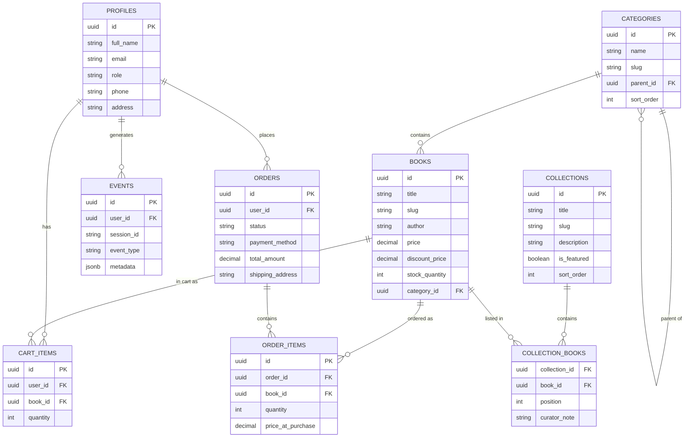
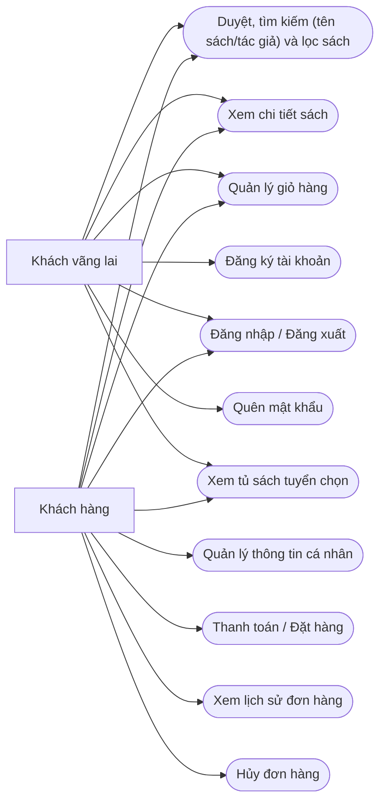
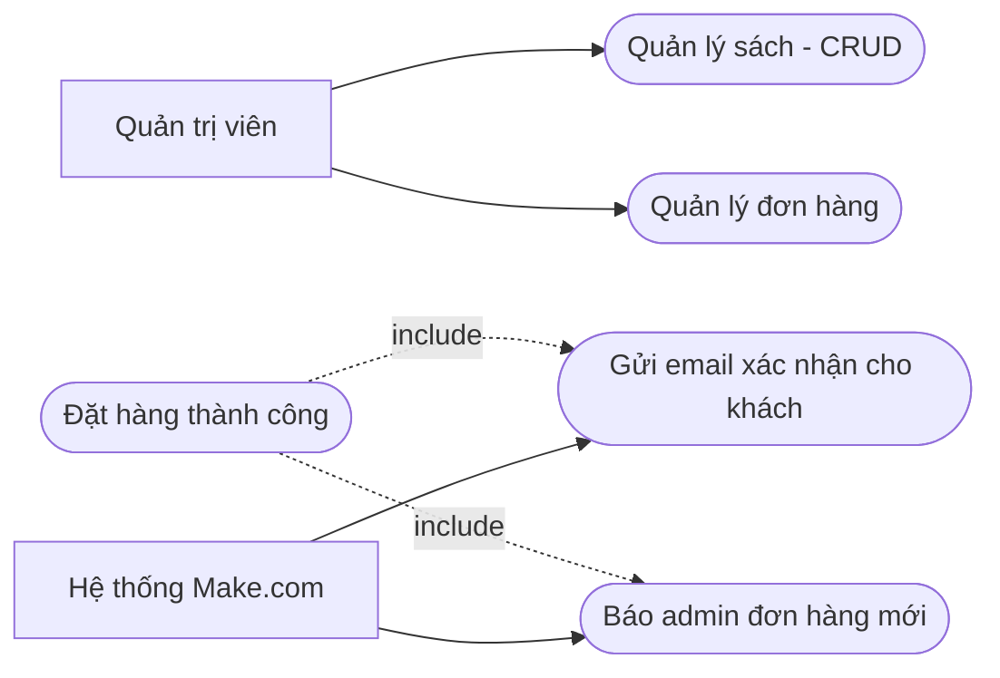

# Đặc tả Yêu cầu Phần mềm (SRS) – NA Books – 7 Tính năng Core

Phiên bản 1.2 · 24/09/2026 · Soạn bởi Lê Minh Đức

Tài liệu liên quan: docs/specs/claude-code-brand-update.md (nhận diện thương hiệu), docs/specs/buoc-1-catalog-chi-tiet.md (triển khai bước 1), docs/mockups/ (mockup giao diện).

## 1. Giới thiệu

Tài liệu đặc tả 7 tính năng Core của website bán sách (dự án showcase/portfolio cá nhân, không kinh doanh thật), làm cơ sở triển khai trực tiếp với Claude Code và minh chứng năng lực đặc tả yêu cầu (BA) cho nhà tuyển dụng.

**Phạm vi.** 7 tính năng: Catalog & tìm kiếm/lọc, Trang chi tiết sách, Giỏ hàng, Checkout, Tài khoản người dùng, Lịch sử đơn hàng, Admin Dashboard cơ bản. Hai tính năng sau nằm **ngoài phạm vi** tài liệu này, đặc tả riêng ở buổi khác: Chatbot trợ lý AI (Gemini) và Dashboard thống kê nâng cao.

Ngoài 7 tính năng Core, bản 1.1 bổ sung hai phần nhỏ phục vụ định vị sản phẩm và đo lường: **Tủ sách tuyển chọn** (mục 5.9) và **Ghi log sự kiện hành vi** (mục 5.8). Phần ghi log chỉ thu thập dữ liệu; Dashboard thống kê nâng cao dùng dữ liệu này vẫn nằm ngoài phạm vi tài liệu.

**Định vị.** Nhà sách tuyển chọn cho người đọc 18–30 tuổi; mỗi lựa chọn sách đều kèm lời giải thích của biên tập. Nguyên tắc thiết kế: "Quen ở cấu trúc, riêng ở chất liệu" — bố cục và luồng mua hàng theo quy ước của các website bán sách Việt Nam, khác biệt nằm ở nhận diện, nội dung tuyển chọn và giọng văn.

**Đối tượng đọc.**

- Nhà tuyển dụng/người đánh giá hồ sơ ứng tuyển vị trí BA/PM/Product — đọc để đánh giá năng lực phân tích và đặc tả yêu cầu.
- Claude Code — đọc phần Functional Requirements (mục 5) để triển khai kỹ thuật; các yêu cầu ở đó viết đủ cụ thể (tên cột, business logic, RLS policy) để dùng trực tiếp làm prompt.

**Tài liệu tham chiếu.** Báo cáo nghiên cứu & so sánh 6 website nhà sách Việt Nam (Fahasa, Nhà sách Phương Nam, Nhã Nam, Thái Hà Books, Alpha Books, IPM/InBook) — cơ sở tham khảo pattern UX, tổ chức danh mục và checkout khi soạn các yêu cầu bên dưới.

## 2. Tổng quan hệ thống

Website bán sách độc lập (single-store), không phải marketplace đa người bán — gần với mô hình nhà xuất bản bán trực tiếp (Nhã Nam, Thái Hà, Alpha Books, IPM) hơn là sàn bán lẻ đa ngành hàng (Fahasa, Phương Nam).

### Tech stack

| Lớp | Công nghệ |
| --- | --- |
| Frontend | Next.js 16 (App Router) + React 19 + Tailwind CSS v4 |
| Backend | Supabase — Postgres + Auth + Storage + Edge Functions |
| Automation | Make.com — email xác nhận đơn hàng, báo admin đơn mới |
| Deploy | Vercel |

### Actors

| Actor | Mô tả | Xác thực |
| --- | --- | --- |
| Khách vãng lai (Guest) | Chưa đăng nhập | Không |
| Khách hàng (Customer) | `profiles.role = 'customer'` | Có |
| Quản trị viên (Admin) | `profiles.role = 'admin'` | Có |

### Database schema

9 bảng Postgres, tất cả đã bật Row Level Security (RLS). Bản 1.0 có 7 bảng; bản 1.1 bổ sung `collections` và `collection_books` (tủ sách tuyển chọn), cột `categories.sort_order` (thứ tự hiển thị menu), và dùng cột `events.metadata` (jsonb) cho ghi log sự kiện. Chi tiết cột xem `supabase/migrations/`.

Bảng `events` nhận log sự kiện hành vi từ các tính năng Core (mục 5.8). Dashboard thống kê nâng cao đọc dữ liệu này và được đặc tả riêng.

## 3. UML Use Case Diagram

Hai sơ đồ: (A) Khách vãng lai & Khách hàng — các tính năng mua sắm; (B) Quản trị viên & automation Make.com — vận hành và tự động hóa.

### A. Khách vãng lai & Khách hàng

Ghi chú: UC3 (Quản lý giỏ hàng) khả dụng cho cả hai actor nhưng lưu dữ liệu khác nơi — giỏ của Khách vãng lai ở `localStorage`, giỏ của Khách hàng ở bảng `cart_items` (chi tiết mục 5.3). UC8 chỉ Khách hàng thực hiện được — Khách vãng lai bấm "Thanh toán" bị chuyển hướng sang UC4/UC5 trước.

### B. Quản trị viên & Automation

Ghi chú: TRIG (Đặt hàng thành công — chính là UC8 ở sơ đồ A) «include» hai use case tự động UC13/UC14, không cần thao tác thủ công của Admin.

## 4. User Stories

29 user story, đánh số US-x.x theo 7 tính năng Core và phần Tủ sách tuyển chọn, theo mẫu "Là \[role\], tôi muốn \[action\] để \[benefit\]".

### 4.1 Catalog & Tìm kiếm/Lọc

- **US-1.1** — Là khách vãng lai, tôi muốn xem danh sách sách theo từng trang để duyệt catalog mà không bị quá tải thông tin.
- **US-1.2** — Là khách vãng lai, tôi muốn tìm sách theo tên sách hoặc tác giả, kể cả khi gõ không dấu, để nhanh chóng tìm được cuốn sách đang cần.
- **US-1.3** — Là khách vãng lai, tôi muốn lọc sách theo danh mục để chỉ xem những sách thuộc thể loại quan tâm.
- **US-1.4** — Là khách vãng lai, tôi muốn lọc sách theo khoảng giá để tìm sách phù hợp ngân sách.
- **US-1.5** — Là khách vãng lai, tôi muốn sắp xếp sách (mới nhất/giá/bán chạy) để dễ so sánh và ra quyết định mua.

### 4.2 Trang chi tiết sách

- **US-2.1** — Là khách vãng lai, tôi muốn xem đầy đủ thông tin một cuốn sách (tác giả, NXB, mô tả, mục lục) để quyết định có mua hay không.
- **US-2.2** — Là khách vãng lai, tôi muốn biết tình trạng còn hàng/hết hàng để không đặt nhầm sách đã hết.
- **US-2.3** — Là khách vãng lai, tôi muốn xem sách liên quan/cùng tác giả để khám phá thêm sách phù hợp sở thích.
- **US-2.4** — Là khách vãng lai, tôi muốn biết cuốn sách đang xem nằm trong tủ sách tuyển chọn nào và vì sao nó được chọn, để có thêm lý do tin tưởng khi quyết định mua.

### 4.3 Giỏ hàng

- **US-3.1** — Là khách vãng lai, tôi muốn thêm sách vào giỏ mà không cần đăng nhập trước để trải nghiệm mua sắm không bị gián đoạn.
- **US-3.2** — Là khách hàng, tôi muốn giỏ hàng thêm lúc chưa đăng nhập được giữ lại khi đăng nhập để không phải thêm lại từ đầu.
- **US-3.3** — Là khách hàng, tôi muốn đổi số lượng hoặc xóa sách khỏi giỏ để điều chỉnh đơn trước khi thanh toán.
- **US-3.4** — Là khách hàng, tôi muốn thấy tổng tiền giỏ hàng cập nhật ngay khi thay đổi số lượng để biết mình sẽ trả bao nhiêu.

### 4.4 Checkout

- **US-4.1** — Là khách hàng, tôi muốn nhập/chọn địa chỉ giao hàng khi đặt hàng để sách được giao đúng nơi.
- **US-4.2** — Là khách hàng, tôi muốn chọn phương thức thanh toán (COD hoặc chuyển khoản) để phù hợp cách tôi muốn trả tiền.
- **US-4.3** — Là khách hàng, tôi muốn nhận email xác nhận sau khi đặt hàng để yên tâm đơn đã được ghi nhận.
- **US-4.4** — Là quản trị viên, tôi muốn được báo ngay khi có đơn hàng mới để xử lý kịp thời.

### 4.5 Tài khoản người dùng

- **US-5.1** — Là khách vãng lai, tôi muốn đăng ký bằng email/mật khẩu để đặt hàng và theo dõi đơn.
- **US-5.2** — Là khách hàng, tôi muốn đăng nhập/đăng xuất để bảo vệ thông tin tài khoản.
- **US-5.3** — Là khách hàng, tôi muốn đặt lại mật khẩu khi quên để không mất quyền truy cập tài khoản.
- **US-5.4** — Là khách hàng, tôi muốn cập nhật thông tin cá nhân (họ tên, SĐT, địa chỉ) để thông tin giao hàng luôn chính xác.

### 4.6 Lịch sử đơn hàng

- **US-6.1** — Là khách hàng, tôi muốn xem danh sách đơn hàng đã đặt để theo dõi lịch sử mua sắm.
- **US-6.2** — Là khách hàng, tôi muốn xem chi tiết một đơn hàng để biết chính xác đơn gồm những gì.
- **US-6.3** — Là khách hàng, tôi muốn hủy đơn khi còn đang chờ xử lý để linh hoạt thay đổi quyết định mua.

### 4.7 Admin Dashboard

- **US-7.1** — Là quản trị viên, tôi muốn thêm/sửa/xóa sách để quản lý catalog sản phẩm.
- **US-7.2** — Là quản trị viên, tôi muốn xem danh sách tất cả đơn hàng để nắm tình hình kinh doanh.
- **US-7.3** — Là quản trị viên, tôi muốn cập nhật trạng thái đơn hàng để phản ánh đúng tiến trình xử lý.

### 4.8 Tủ sách tuyển chọn

- **US-8.1** — Là khách vãng lai, tôi muốn xem các tủ sách tuyển chọn kèm lời giới thiệu để khám phá sách phù hợp mà không cần biết trước tên sách.
- **US-8.2** — Là khách vãng lai, tôi muốn đọc lý do từng cuốn được đưa vào tủ sách để chọn cuốn hợp với mình nhất.

## 5. Functional Requirements

60 yêu cầu chức năng, đánh số FR-x.x theo 7 tính năng Core và phần Tủ sách tuyển chọn/Ghi log sự kiện — đủ chi tiết (tên cột, business logic, RLS) để đưa thẳng cho Claude Code triển khai.

### 5.1 Catalog & Tìm kiếm/Lọc

- **FR-1.1** — Hiển thị danh sách sách dạng lưới; mỗi thẻ gồm: ảnh bìa (sinh tự động qua `<BookCover>`, xem FR-2.8), tên sách, tác giả, giá gốc (`price`), giá giảm (`discount_price` nếu có, gạch ngang giá gốc), trạng thái còn hàng/hết hàng.
- **FR-1.2** — Phân trang, mặc định 20 sách/trang.
- **FR-1.3** — Tìm kiếm theo tên sách (`title`) **hoặc** tác giả (`author`), không phân biệt hoa/thường và **không phân biệt dấu tiếng Việt** (dùng extension `unaccent` qua hàm `f_unaccent`), khớp một phần chuỗi. Từ khóa được trim, tối đa 100 ký tự, escape ký tự `%` và `_`.
- **FR-1.4** — Lọc theo `category_id`. Chọn category cha (`parent_id IS NULL`) → kết quả gồm cả sách thuộc các category con trực tiếp của nó.
- **FR-1.5** — Lọc theo khoảng giá (min–max), áp dụng trên giá thực tế phải trả: `COALESCE(discount_price, price)`.
- **FR-1.6** — Sắp xếp theo: (a) Mới nhất (`created_at` giảm dần — mặc định), (b) Giá tăng dần, (c) Giá giảm dần, (d) Bán chạy nhất.
- **FR-1.7** — "Bán chạy nhất" = `SUM(order_items.quantity)` nhóm theo `book_id`, chỉ tính đơn có `status != 'cancelled'`; sách chưa có đơn xếp cuối. Vì RLS không cho khách đọc đơn hàng của người khác, phép tính này chạy trong hàm `search_books` với `SECURITY DEFINER`; hàm chỉ trả về các cột công khai của sách.
- **FR-1.8** — Các bộ lọc (category, khoảng giá, từ khóa, sắp xếp) kết hợp đồng thời được.
- **FR-1.9** — `stock_quantity = 0` → hiển thị nhãn "Hết hàng" trên thẻ sách.
- **FR-1.10** — Không yêu cầu đăng nhập; áp dụng cho Khách vãng lai và Khách hàng.
- **FR-1.11** — Toàn bộ lọc, sắp xếp và phân trang được gói trong một hàm RPC `search_books(p_q, p_category_slug, p_min, p_max, p_sort, p_page)`. Mọi kiểu sắp xếp có tie-break `created_at desc, id` để phân trang ổn định. Page size cố định 20, không nhận từ client.
- **FR-1.12** — Trang catalog dùng route `/sach`; mọi bộ lọc nằm trên URL (`q`, `category`, `min`, `max`, `sort`, `page`) để có thể chia sẻ link và nút Back hoạt động đúng.

### 5.2 Trang chi tiết sách

- **FR-2.1** — Truy cập qua `/sach/[slug]`, hiển thị đầy đủ: `title`, `author`, `translator` (nếu có), `publisher`, `description`, `table_of_contents`, `price`, `discount_price` (nếu có), `isbn`, `page_count`, `dimensions`, `publish_date`, ảnh bìa (sinh tự động qua `<BookCover>`, xem FR-2.8), tên category, trạng thái còn hàng (không hiển thị số lượng tồn kho chính xác). Các trường có giá trị `null` được ẩn hoàn toàn (không hiển thị "Đang cập nhật"). Trạng thái kho hiển thị bằng chữ: "Còn hàng" hoặc "Hết hàng".
- **FR-2.2** — `stock_quantity = 0` → vô hiệu hóa nút "Thêm vào giỏ hàng", hiển thị rõ nhãn "Hết hàng".
- **FR-2.3** — Hiển thị tối đa 4 sách liên quan: ưu tiên cùng danh mục con (`category_id`), loại trừ sách đang xem, mới nhất trước. Nếu chưa đủ 4 cuốn, lấy thêm từ các danh mục con khác cùng danh mục cha. Tiêu đề khối ghi tên danh mục thực tế đã dùng. Ẩn khối nếu không có sách nào.
- **FR-2.4** — Slug không tồn tại → trả về trang 404.
- **FR-2.5** — Không yêu cầu đăng nhập.
- **FR-2.6** — Khối "Có trong tủ sách": liệt kê mọi tủ sách chứa cuốn đang xem, mỗi tủ gồm tên (link tới `/tu-sach/[slug]`) và `curator_note` của cuốn đó. Ẩn khối nếu sách không thuộc tủ nào.
- **FR-2.7** — Trên mobile (< 768px), nút "Thêm vào giỏ" và "Mua ngay" nằm trong thanh dính ở đáy màn hình.
- **FR-2.8** — Trong phạm vi hiện tại, ảnh bìa hiển thị ở mọi nơi (catalog, trang chi tiết, tủ sách) đều do `<BookCover>` sinh tự động từ `title`, `author` và `slug` (nền màu ổn định theo hash `slug`, tên sách/tác giả hiển thị bằng chữ) — không dùng ảnh bìa có bản quyền, không hotlink ảnh từ nguồn ngoài. Cột `cover_image_url` của bảng `books` giữ lại trong schema cho khả năng mở rộng sau này, nhưng không dùng trong phạm vi hiện tại (luôn `null`).

### 5.3 Giỏ hàng

- **FR-3.1** — Khách vãng lai thêm sách vào giỏ được lưu tại `localStorage` của trình duyệt, dạng mảng `{book_id, quantity}`.
- **FR-3.2** — Khách hàng thêm sách vào giỏ được lưu vào bảng `cart_items` (`user_id`, `book_id`, `quantity`).
- **FR-3.3** — Thêm sách đã có sẵn trong giỏ → cộng dồn `quantity`, không tạo dòng mới. Áp dụng ràng buộc `UNIQUE (user_id, book_id)` ở tầng database.
- **FR-3.4** — Ngay sau khi Khách vãng lai đăng nhập/đăng ký thành công: với mỗi item trong `localStorage`, nếu `book_id` đã tồn tại trong `cart_items` của user thì cộng dồn `quantity`, chưa có thì insert dòng mới; merge xong thì xóa dữ liệu giỏ khỏi `localStorage`.
- **FR-3.5** — Cho phép đổi số lượng (`quantity ≥ 1`) hoặc xóa từng dòng khỏi giỏ.
- **FR-3.6** — `quantity` nhập vào vượt `stock_quantity` hiện có → giới hạn tối đa bằng `stock_quantity`, hiển thị cảnh báo.
- **FR-3.7** — Tổng tiền giỏ hàng = `SUM(quantity × giá thực tế)` từng sách, cập nhật theo thời gian thực khi có thay đổi.
- **FR-3.8** — RLS: `cart_items` — user chỉ đọc/ghi/xóa dòng có `user_id = auth.uid()` của chính mình.

### 5.4 Checkout

- **FR-4.1** — Yêu cầu đăng nhập. Khách vãng lai bấm "Thanh toán" → chuyển hướng đăng nhập/đăng ký, sau đó quay lại checkout với giỏ hàng đã merge (FR-3.4).
- **FR-4.2** — Trang checkout hiển thị: danh sách sách trong giỏ, tổng tiền, form nhập địa chỉ giao hàng (`shipping_address` — điền sẵn từ `profiles.address` nếu có, cho phép sửa), chọn phương thức thanh toán (`payment_method` — "COD" hoặc "Chuyển khoản").
- **FR-4.3** — Xác nhận đặt hàng thực hiện tuần tự trong 1 transaction (khuyến nghị Supabase Edge Function/Postgres function, tránh thao tác rời rạc từ client):
  1. Kiểm tra lại `stock_quantity` từng sách trong giỏ tại thời điểm đặt — không đủ số lượng thì hủy thao tác, báo lỗi.
  2. Tạo 1 dòng `orders` (`user_id`, `status='pending'`, `payment_method`, `total_amount`, `shipping_address`).
  3. Tạo các dòng `order_items` tương ứng (`order_id`, `book_id`, `quantity`, `price_at_purchase` = giá thực tế tại thời điểm đặt).
  4. Trừ `stock_quantity` từng sách theo `quantity` đã đặt.
  5. Xóa các dòng `cart_items` tương ứng của user.
- **FR-4.4** — Sau khi tạo đơn thành công, gọi webhook Make.com (Database Webhook trên `INSERT` của bảng `orders`, hoặc trigger từ Edge Function) để: gửi email xác nhận cho khách (theo `profiles.email`), và báo admin có đơn mới.
- **FR-4.5** — `payment_method` chỉ mang tính lưu trữ lựa chọn — không xử lý thanh toán thật, không tích hợp cổng thanh toán.
- **FR-4.6** — Đặt hàng thành công → chuyển hướng trang xác nhận, hiển thị mã đơn và tóm tắt đơn.

### 5.5 Tài khoản người dùng

- **FR-5.1** — Đăng ký bằng email + mật khẩu (Supabase Auth), tối thiểu: `full_name`, `email`, `password` (≥ 6 ký tự — mặc định Supabase Auth). Không bật xác thực email (email confirmation) để demo mượt.
- **FR-5.2** — Đăng ký thành công → tự động tạo dòng `profiles` (`id` = auth user id, `role = 'customer'` mặc định — không cho tự chọn role, `email` đồng bộ từ `auth.users.email` qua Postgres trigger khi insert vào `auth.users`).
- **FR-5.3** — Đăng nhập bằng email + mật khẩu; đăng xuất xóa session hiện tại.
- **FR-5.4** — Quên mật khẩu dùng cơ chế reset password mặc định của Supabase Auth (email chứa link đặt lại).
- **FR-5.5** — Khách hàng xem/cập nhật được `full_name`, `phone`, `address` của chính mình trong `profiles`; không tự đổi `role` hoặc `email` qua giao diện.
- **FR-5.6** — RLS: `profiles` — user đọc/sửa dòng có `id = auth.uid()` của chính mình; Admin (`role='admin'`) đọc được mọi dòng (phục vụ Admin Dashboard xem thông tin khách theo đơn).

### 5.6 Lịch sử đơn hàng

- **FR-6.1** — Khách hàng xem danh sách đơn hàng của mình (`orders WHERE user_id = auth.uid()`), mới nhất trước; hiển thị: mã đơn, ngày đặt, tổng tiền, trạng thái.
- **FR-6.2** — Xem chi tiết 1 đơn: danh sách sách đã mua (`quantity`, `price_at_purchase`), tổng tiền, địa chỉ giao hàng, phương thức thanh toán, trạng thái hiện tại.
- **FR-6.3** — Khách hàng chỉ hủy được đơn (`status → 'cancelled'`) khi đơn đang `'pending'`. Từ `'processing'` trở đi, chỉ Admin đổi được status.
- **FR-6.4** — Đơn bị hủy (dù bởi khách hay Admin) → cộng trả lại `stock_quantity` tương ứng từng sách trong đơn (khuyến nghị xử lý qua Edge Function/database trigger khi `status` chuyển sang `'cancelled'`, đảm bảo nhất quán dù hủy từ phía nào).
- **FR-6.5** — RLS: `orders` — `SELECT` cho `user_id = auth.uid()`; `UPDATE` do khách tự thực hiện CHỈ áp dụng `USING (user_id = auth.uid() AND status = 'pending')` và `WITH CHECK (status = 'cancelled')` — khách không tự đặt được trạng thái nào khác ngoài hủy, và chỉ hủy được đơn đang `pending`.

### 5.7 Admin Dashboard

- **FR-7.1** — Chỉ `role='admin'` truy cập được `/admin/*`; kiểm tra role ở cả middleware (route protection) lẫn RLS (bảo vệ 2 lớp).
- **FR-7.2** — Quản lý sách: Admin xem danh sách toàn bộ sách (phân trang/tìm kiếm), thêm sách mới (đủ các trường bảng `books`), sửa thông tin, xóa sách.
- **FR-7.3** — Trước khi xóa 1 sách, kiểm tra sách có đang xuất hiện trong `order_items` nào không — nếu có, chặn xóa cứng, gợi ý đặt `stock_quantity = 0` thay thế để không phá vỡ dữ liệu lịch sử đơn hàng.
- **FR-7.4** — Quản lý đơn hàng: Admin xem danh sách toàn bộ đơn (lọc theo status, tìm theo mã đơn/tên khách), xem chi tiết 1 đơn (kèm thông tin khách từ `profiles`), cập nhật status theo luồng `pending → processing → shipped → completed` (hoặc `→ cancelled` ở bất kỳ bước nào trước `completed`).
- **FR-7.5** — RLS: `books` — `SELECT` public (mọi actor), `INSERT`/`UPDATE`/`DELETE` chỉ `role='admin'`. `orders`/`order_items` — `SELECT`/`UPDATE` toàn quyền chỉ `role='admin'` (kết hợp quyền hạn chế của khách hàng ở FR-6.5).
- **FR-7.6** — `categories` không có giao diện quản lý trong phạm vi MVP — dữ liệu được seed sẵn (migration/seed script), chỉnh sửa trực tiếp qua Supabase Dashboard nếu cần. RLS vẫn cho phép Admin ghi (xem mục 5.10) để sẵn sàng khi có giao diện quản lý sau này.

### 5.8 Ghi log sự kiện

- **FR-8.1** — Hệ thống ghi sự kiện hành vi vào bảng `events` qua hàm `track(event_type, metadata)` phía client, theo kiểu fire-and-forget: không chặn giao diện, lỗi không hiển thị cho người dùng.
- **FR-8.2** — Mỗi sự kiện có `session_id` (UUID ẩn danh lưu trong `localStorage`) và `user_id` (null nếu chưa đăng nhập).
- **FR-8.3** — Các loại sự kiện hợp lệ: `page_view`, `search`, `add_to_cart`, `checkout_started`, `order_placed` (ràng buộc CHECK ở database).
- **FR-8.4** — `page_view` được ghi khi mở trang chi tiết sách (`metadata`: `book_id`, `slug`). `search` được ghi khi trang catalog có từ khóa (`metadata`: `q`, `results_count`, `category`, `sort`), kể cả khi không có kết quả. `add_to_cart`, `checkout_started`, `order_placed` được ghi ở các tính năng Giỏ hàng và Checkout.
- **FR-8.5** — `metadata` không chứa dữ liệu cá nhân (email, tên, địa chỉ, số điện thoại) và tối đa 2KB.
- **FR-8.6** — RLS: ai cũng được `INSERT`, nhưng chỉ với `user_id` là null hoặc bằng `auth.uid()`. Chỉ Admin được `SELECT`.

### 5.9 Tủ sách tuyển chọn

- **FR-9.1** — Tủ sách gồm tên, slug, lời giới thiệu của biên tập (`description`), thứ tự hiển thị, và danh sách sách có thứ tự (`position`). Mỗi sách trong tủ có lời giải thích riêng (`curator_note`).
- **FR-9.2** — Tối đa một tủ sách được đánh dấu nổi bật (`is_featured`), ràng buộc bằng unique index. Tủ này hiển thị ở hero trang chủ. Không có tủ nổi bật thì ẩn hero, không báo lỗi.
- **FR-9.3** — `/tu-sach` liệt kê mọi tủ sách; `/tu-sach/[slug]` hiển thị lời giới thiệu và danh sách sách kèm `curator_note`. Slug không tồn tại thì trả về trang 404.
- **FR-9.4** — Trong phạm vi MVP, tủ sách không có giao diện quản lý; dữ liệu được seed sẵn và chỉnh qua Supabase Dashboard. RLS: `SELECT` công khai, ghi chỉ Admin.

### 5.10 Tóm tắt RLS theo bảng

| Bảng | Khách vãng lai | Khách hàng | Admin |
| --- | --- | --- | --- |
| `profiles` | — | SELECT/UPDATE dòng của mình | SELECT toàn bộ |
| `categories` | SELECT toàn bộ | SELECT toàn bộ | SELECT/INSERT/UPDATE/DELETE toàn bộ |
| `books` | SELECT toàn bộ | SELECT toàn bộ | SELECT/INSERT/UPDATE/DELETE toàn bộ |
| `cart_items` | — (localStorage) | SELECT/INSERT/UPDATE/DELETE dòng của mình | — |
| `orders` | — | SELECT dòng của mình; UPDATE chỉ khi `pending → cancelled` | SELECT/UPDATE toàn bộ |
| `order_items` | — | SELECT qua đơn của mình | SELECT toàn bộ |
| `collections` | SELECT toàn bộ | SELECT toàn bộ | SELECT/INSERT/UPDATE/DELETE toàn bộ |
| `collection_books` | SELECT toàn bộ | SELECT toàn bộ | SELECT/INSERT/UPDATE/DELETE toàn bộ |
| `events` | INSERT (`user_id` null) | INSERT (`user_id` = của mình hoặc null) | SELECT toàn bộ |

## 6. Non-functional Requirements

22 yêu cầu phi chức năng, nhóm theo 6 nhóm chuẩn SRS: hiệu năng, bảo mật, khả năng sử dụng, khả năng bảo trì/mở rộng, tương thích, khả năng tiếp cận.

### 6.1 Hiệu năng

- **NFR-1.1** — Trang catalog và trang chi tiết sách tải dưới 2 giây trên kết nối mạng trung bình (Core Web Vitals: LCP < 2.5s).
- **NFR-1.2** — Ảnh bìa sách lưu trên Supabase Storage, tối ưu qua Next.js `Image` component (lazy loading, responsive sizing, WebP khi trình duyệt hỗ trợ).
- **NFR-1.3** — Lọc/sắp xếp/tìm kiếm ở catalog thực hiện phía server; không tải toàn bộ dữ liệu sách về client rồi lọc.

### 6.2 Bảo mật

- **NFR-2.1** — Toàn bộ bảng trong schema `public` bật Row Level Security; không bảng nào cho phép truy cập ngoài các policy đã định nghĩa (chi tiết theo bảng ở mục 5.10).
- **NFR-2.2** — API key (Gemini cho chatbot — cấu hình buổi khác), Supabase service role key, Make.com webhook secret — không expose ra phía client, chỉ dùng trong Edge Functions/server-side code.
- **NFR-2.3** — Input từ mọi form (đăng ký, checkout, thêm/sửa sách...) validate cả client (UX) lẫn server/database (ràng buộc thật, không tin dữ liệu từ client).
- **NFR-2.4** — Mật khẩu không lưu dạng plaintext (Supabase Auth mặc định hash bằng bcrypt).
- **NFR-2.5** — Middleware kiểm tra `role='admin'` cho mọi route `/admin/*` trước khi render, tránh lộ giao diện quản trị qua URL trực tiếp.

### 6.3 Khả năng sử dụng

- **NFR-3.1** — Giao diện responsive: mobile (≥375px), tablet, desktop.
- **NFR-3.2** — Thông báo lỗi (hết hàng, sai mật khẩu, hết hạn phiên...) bằng tiếng Việt, rõ ràng, không lộ mã lỗi kỹ thuật thô.
- **NFR-3.3** — Thao tác quan trọng (xóa sách, hủy đơn) yêu cầu xác nhận (confirm dialog) trước khi thực hiện.
- **NFR-3.4** — Mọi chữ hiển thị viết bằng tiếng Việt theo giọng văn thống nhất: NA Books xưng "chúng mình", gọi người dùng là "bạn"; không dùng teen-code, không lạm dụng dấu "!".

### 6.4 Khả năng bảo trì & mở rộng

- **NFR-4.1** — Code theo cấu trúc chuẩn Next.js App Router: tách components tái sử dụng, business logic (Edge Functions/API routes), truy vấn dữ liệu (Supabase client).
- **NFR-4.2** — Mọi thay đổi schema đi qua file migration trong `supabase/migrations/`, không sửa trực tiếp qua Table Editor, để schema trong repo và trong database luôn khớp nhau.

### 6.5 Tương thích

- **NFR-5.1** — Hỗ trợ trình duyệt hiện đại: Chrome, Firefox, Safari, Edge (2 phiên bản gần nhất).
- **NFR-5.2** — Tương thích thiết bị di động phổ biến (iOS Safari, Android Chrome).

### 6.6 Khả năng tiếp cận (Accessibility)

- **NFR-6.1** — Độ tương phản chữ đạt WCAG 2.1 AA (≥ 4.5:1 với chữ thường, ≥ 3:1 với chữ ≥ 18px).
- **NFR-6.2** — Vùng chạm tối thiểu 44×44px trên mobile.
- **NFR-6.3** — Mọi phần tử tương tác có focus state nhìn thấy được và điều hướng được bằng bàn phím.
- **NFR-6.4** — Ảnh bìa có `alt` là tên sách; icon trang trí có `aria-hidden`.
- **NFR-6.5** — Không truyền đạt thông tin chỉ bằng màu sắc.
- **NFR-6.6** — Chữ nội dung tối thiểu 14px.

## 7. Lịch sử thay đổi

| Phiên bản | Ngày | Nội dung |
| --- | --- | --- |
| 1.0 | 21/09/2026 | Bản đầu: 7 tính năng Core. |
| 1.1 | 22/09/2026 | Tìm kiếm theo tác giả, không dấu (FR-1.3); RPC `search_books` (FR-1.11); route `/sach` (FR-1.12, FR-2.1); sách liên quan có phương án dự phòng (FR-2.3); khối "Có trong tủ sách" (FR-2.6); thanh mua hàng dính đáy trên mobile (FR-2.7); ghi log sự kiện (5.8); tủ sách tuyển chọn (5.9); schema 9 bảng; NFR giọng văn (NFR-3.4) và accessibility (6.6). |
| 1.2 | 24/09/2026 | Chính thức hoá chính sách bìa sách: không dùng ảnh bìa bản quyền, toàn bộ bìa do `<BookCover>` sinh tự động từ `title`/`author`/`slug` (FR-2.8 mới); `cover_image_url` giữ trong schema `books` cho khả năng mở rộng sau này nhưng không dùng ở phạm vi hiện tại; cập nhật FR-1.1, FR-2.1 cho khớp. |
