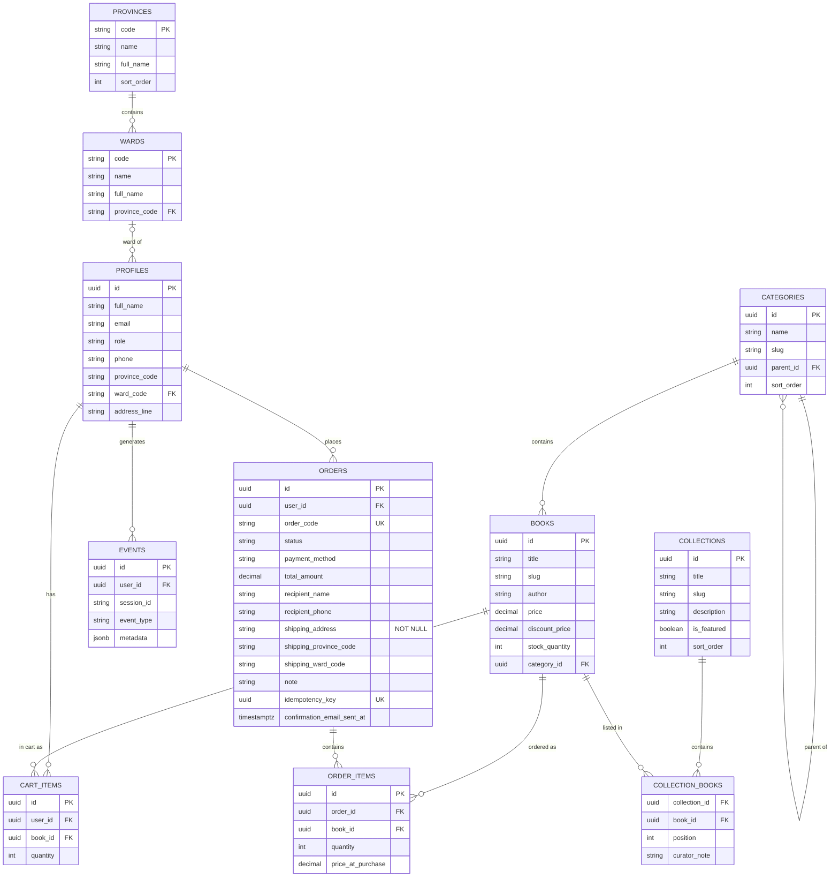
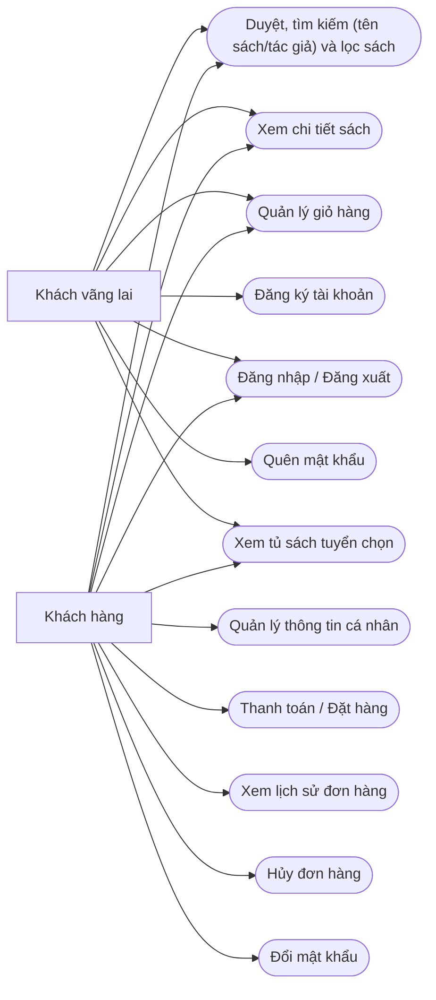
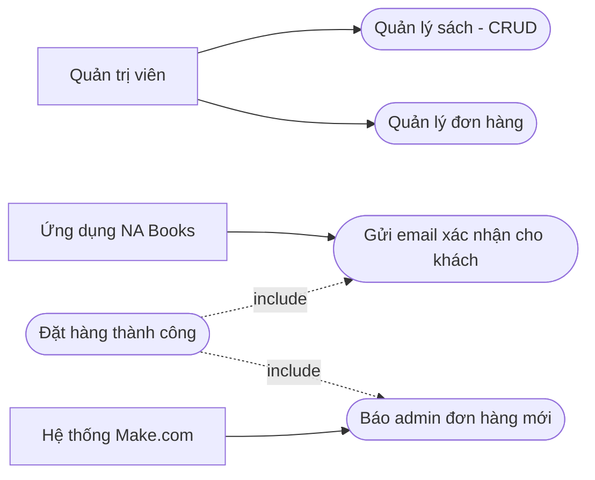

# Đặc tả Yêu cầu Phần mềm (SRS) – NA Books – 7 Tính năng Core

Phiên bản 1.12 · 06/10/2026 · Soạn bởi Lê Minh Đức

Tài liệu liên quan: docs/specs/claude-code-brand-update.md (nhận diện thương hiệu), docs/specs/buoc-1-catalog-chi-tiet.md (triển khai bước 1), docs/mockups/ (mockup giao diện).

## 1. Giới thiệu

Tài liệu đặc tả 7 tính năng Core của website bán sách (dự án showcase/portfolio cá nhân, không kinh doanh thật), làm cơ sở triển khai trực tiếp với Claude Code và minh chứng năng lực đặc tả yêu cầu (BA) cho nhà tuyển dụng.

**Phạm vi.** 7 tính năng: Catalog & tìm kiếm/lọc, Trang chi tiết sách, Giỏ hàng, Checkout, Tài khoản người dùng, Lịch sử đơn hàng, Admin Dashboard cơ bản. Hai tính năng sau nằm **ngoài phạm vi** tài liệu này, đặc tả riêng ở buổi khác: Chatbot trợ lý AI (Gemini) và Dashboard thống kê nâng cao. Ba hạng mục sau cũng nằm **ngoài phạm vi** bản này: đăng nhập bằng magic link, đăng nhập bằng Google và danh sách yêu thích (wishlist).

Ngoài 7 tính năng Core, bản 1.1 bổ sung hai phần nhỏ phục vụ định vị sản phẩm và đo lường: **Tủ sách tuyển chọn** (mục 5.9) và **Ghi log sự kiện hành vi** (mục 5.8). Phần ghi log chỉ thu thập dữ liệu; Dashboard thống kê nâng cao dùng dữ liệu này vẫn nằm ngoài phạm vi tài liệu.

**Định vị.** Nhà sách tuyển chọn cho người đọc 18–30 tuổi; mỗi lựa chọn sách đều kèm lời giải thích của biên tập. Nguyên tắc thiết kế: "Quen ở cấu trúc, riêng ở chất liệu" — bố cục và luồng mua hàng theo quy ước của các website bán sách Việt Nam, khác biệt nằm ở nhận diện, nội dung tuyển chọn và giọng văn.

**Đối tượng đọc.**

- Nhà tuyển dụng/người đánh giá hồ sơ ứng tuyển vị trí BA/PM/Product — đọc để đánh giá năng lực phân tích và đặc tả yêu cầu.
- Claude Code — đọc phần Functional Requirements (mục 5) để triển khai kỹ thuật; các yêu cầu ở đó viết đủ cụ thể (tên cột, business logic, RLS policy) để dùng trực tiếp làm prompt.

**Tài liệu tham chiếu.** Báo cáo nghiên cứu & so sánh 6 website nhà sách Việt Nam (Fahasa, Nhà sách Phương Nam, Nhã Nam, Thái Hà Books, Alpha Books, IPM/InBook) — cơ sở tham khảo pattern UX, tổ chức danh mục và checkout khi soạn các yêu cầu bên dưới.

## 2. Tổng quan hệ thống

Website bán sách độc lập (single-store), không phải marketplace đa người bán — gần với mô hình nhà xuất bản bán trực tiếp (Nhã Nam, Thái Hà, Alpha Books, IPM) hơn là sàn bán lẻ đa ngành hàng (Fahasa, Phương Nam).

### Tech stack

| Lớp | Công nghệ |
| --- | --- |
| Frontend | Next.js 16 (App Router) + React 19 + Tailwind CSS v4 |
| Backend | Supabase — Postgres + Auth + Storage + Edge Functions |
| Automation | Make.com — lớp vận hành back-office (sổ đơn, báo đơn, digest kho), làm ở đợt admin |
| Deploy | Vercel |

Bản 1.3 bổ sung ghi nhận hệ token màu hiện tại (Tailwind v4, khai báo trong `app/globals.css`): chàm thương hiệu `cham-700` (thành phần sáng — Hero, nút chính, liên kết) và `cham-900` (nền tối — Footer, khối editorial, lớp phủ mờ); hai lớp nền sáng phân biệt `paper` (nền trang) và `surface` (nền thẻ/card); 5 màu riêng theo từng danh mục sách cha, dùng cho thẻ danh mục ở trang chủ và dải màu nhận diện trên trang catalog.

### Actors

| Actor | Mô tả | Xác thực |
| --- | --- | --- |
| Khách vãng lai (Guest) | Chưa đăng nhập | Không |
| Khách hàng (Customer) | `profiles.role = 'customer'` | Có |
| Quản trị viên (Admin) | `profiles.role = 'admin'` | Có |

### Database schema

11 bảng Postgres, tất cả đã bật Row Level Security (RLS). Bản 1.0 có 7 bảng; bản 1.1 bổ sung `collections` và `collection_books` (tủ sách tuyển chọn), cột `categories.sort_order` (thứ tự hiển thị menu), và dùng cột `events.metadata` (jsonb) cho ghi log sự kiện; bản 1.4 bổ sung `provinces` và `wards` (dữ liệu hành chính, FR-5.8) cùng các cột `profiles.email`, `profiles.province_code`, `profiles.ward_code`, `profiles.address_line`; bản 1.6 bỏ cột `profiles.address` (FR-5.5), thêm `full_name` cho cả hai bảng hành chính và `sort_order` cho `provinces` (FR-5.8), và thêm vào `orders` các cột `order_code`, `idempotency_key`, `recipient_name`, `recipient_phone`, `shipping_province_code`, `shipping_ward_code`, `note`, `confirmation_email_sent_at` (FR-4.2, FR-4.4); đồng thời siết `NOT NULL` cho `orders.user_id`, `orders.status`, `orders.shipping_address`, `order_items.order_id` và `order_items.book_id` (trước đó nullable; các bảng 0 dòng nên không mất dữ liệu). Các bảng và cột hành chính của bản 1.4 và 1.6, cùng các cột mới của `orders`, được cài bằng migration của đợt 3B (`docs/specs/buoc-3b-checkout.md`); trước đó database thật chưa có. Chi tiết cột xem `supabase/migrations/`.

```mermaid
erDiagram
    PROFILES ||--o{ ORDERS : places
    PROFILES ||--o{ CART_ITEMS : has
    PROFILES ||--o{ EVENTS : generates
    CATEGORIES ||--o{ CATEGORIES : "parent of"
    CATEGORIES ||--o{ BOOKS : contains
    BOOKS ||--o{ CART_ITEMS : "in cart as"
    BOOKS ||--o{ ORDER_ITEMS : "ordered as"
    ORDERS ||--o{ ORDER_ITEMS : contains
    COLLECTIONS ||--o{ COLLECTION_BOOKS : contains
    BOOKS ||--o{ COLLECTION_BOOKS : "listed in"
    PROVINCES ||--o{ WARDS : contains
    WARDS |o--o{ PROFILES : "ward of"

    PROFILES {
        uuid id PK
        string full_name
        string email
        string role
        string phone
        string province_code
        string ward_code FK
        string address_line
    }
    PROVINCES {
        string code PK
        string name
        string full_name
        int sort_order
    }
    WARDS {
        string code PK
        string name
        string full_name
        string province_code FK
    }
    CATEGORIES {
        uuid id PK
        string name
        string slug
        uuid parent_id FK
        int sort_order
    }
    BOOKS {
        uuid id PK
        string title
        string slug
        string author
        decimal price
        decimal discount_price
        int stock_quantity
        uuid category_id FK
    }
    CART_ITEMS {
        uuid id PK
        uuid user_id FK
        uuid book_id FK
        int quantity
    }
    ORDERS {
        uuid id PK
        uuid user_id FK
        string order_code UK
        string status
        string payment_method
        decimal total_amount
        string recipient_name
        string recipient_phone
        string shipping_address "NOT NULL"
        string shipping_province_code
        string shipping_ward_code
        string note
        uuid idempotency_key UK
        timestamptz confirmation_email_sent_at
    }
    ORDER_ITEMS {
        uuid id PK
        uuid order_id FK
        uuid book_id FK
        int quantity
        decimal price_at_purchase
    }
    EVENTS {
        uuid id PK
        uuid user_id FK
        string session_id
        string event_type
        jsonb metadata
    }
    COLLECTIONS {
        uuid id PK
        string title
        string slug
        string description
        boolean is_featured
        int sort_order
    }
    COLLECTION_BOOKS {
        uuid collection_id FK
        uuid book_id FK
        int position
        string curator_note
    }
```

`profiles` tham chiếu `wards` bằng một khoá ngoại kép `(ward_code, province_code)` với `MATCH FULL`; sơ đồ ER không diễn tả được khoá nhiều cột nên chỉ vẽ một quan hệ. `orders.shipping_province_code` và `orders.shipping_ward_code` không có khoá ngoại có chủ đích: đơn hàng là bản ghi lịch sử, một lần tổ chức lại hành chính sau này không được làm đơn cũ sai hoặc không xoá được (FR-4.2) — nên sơ đồ không vẽ quan hệ từ `ORDERS` tới `WARDS`.

Bảng `events` nhận log sự kiện hành vi từ các tính năng Core (mục 5.8). Dashboard thống kê nâng cao đọc dữ liệu này và được đặc tả riêng.

## 3. UML Use Case Diagram

Hai sơ đồ: (A) Khách vãng lai & Khách hàng — các tính năng mua sắm; (B) Quản trị viên & Automation — vận hành và tự động hóa (email cho khách do ứng dụng gửi; báo cửa hàng và vận hành back-office qua Make.com).

### A. Khách vãng lai & Khách hàng

```mermaid
flowchart LR
    G[Khách vãng lai]
    C[Khách hàng]

    UC1(["Duyệt, tìm kiếm (tên sách/tác giả) và lọc sách"])
    UC2([Xem chi tiết sách])
    UC3([Quản lý giỏ hàng])
    UC4([Đăng ký tài khoản])
    UC5([Đăng nhập / Đăng xuất])
    UC6([Quên mật khẩu])
    UC7([Quản lý thông tin cá nhân])
    UC8([Thanh toán / Đặt hàng])
    UC9([Xem lịch sử đơn hàng])
    UC10([Hủy đơn hàng])
    UC15([Xem tủ sách tuyển chọn])
    UC16([Đổi mật khẩu])

    G --> UC1
    G --> UC2
    G --> UC3
    G --> UC4
    G --> UC5
    G --> UC6
    G --> UC15
    C --> UC1
    C --> UC2
    C --> UC3
    C --> UC5
    C --> UC7
    C --> UC8
    C --> UC9
    C --> UC10
    C --> UC15
    C --> UC16
```

Ghi chú: UC3 (Quản lý giỏ hàng) khả dụng cho cả hai actor nhưng lưu dữ liệu khác nơi — giỏ của Khách vãng lai ở cookie `na_cart`, giỏ của Khách hàng ở bảng `cart_items` (chi tiết mục 5.3). UC8 chỉ Khách hàng thực hiện được — Khách vãng lai bấm "Thanh toán" bị chuyển hướng sang UC4/UC5 trước.

### B. Quản trị viên & Automation

```mermaid
flowchart LR
    ADM[Quản trị viên]
    APP[Ứng dụng NA Books]
    SYS[Hệ thống Make.com]
    TRIG([Đặt hàng thành công])

    UC11([Quản lý sách - CRUD])
    UC12([Quản lý đơn hàng])
    UC13([Gửi email xác nhận cho khách])
    UC14([Báo admin đơn hàng mới])

    ADM --> UC11
    ADM --> UC12
    TRIG -.include.-> UC13
    TRIG -.include.-> UC14
    APP --> UC13
    SYS --> UC14
```

Ghi chú: TRIG (Đặt hàng thành công — chính là UC8 ở sơ đồ A) «include» hai use case tự động UC13/UC14, không cần thao tác thủ công của Admin. UC13 (gửi email xác nhận cho khách) do **ứng dụng** thực hiện qua HTTP API của Brevo, không do Make.com: đó là việc khách đang chờ nên phải đáng tin và kiểm được bằng test trong repo (FR-4.4). UC14 (báo admin đơn mới) do Make.com thực hiện, scenario dựng ở đợt Admin; ứng dụng chỉ để sẵn đường gọi webhook.

## 4. User Stories

30 user story, đánh số US-x.x theo 7 tính năng Core và phần Tủ sách tuyển chọn, theo mẫu "Là \[role\], tôi muốn \[action\] để \[benefit\]".

### 4.1 Catalog & Tìm kiếm/Lọc

- **US-1.1** — Là khách vãng lai, tôi muốn xem danh sách sách theo từng trang để duyệt catalog mà không bị quá tải thông tin.
- **US-1.2** — Là khách vãng lai, tôi muốn tìm sách theo tên sách hoặc tác giả, kể cả khi gõ không dấu, để nhanh chóng tìm được cuốn sách đang cần.
- **US-1.3** — Là khách vãng lai, tôi muốn lọc sách theo danh mục để chỉ xem những sách thuộc thể loại quan tâm.
- **US-1.4** — Là khách vãng lai, tôi muốn lọc sách theo khoảng giá để tìm sách phù hợp ngân sách.
- **US-1.5** — Là khách vãng lai, tôi muốn sắp xếp sách (mới nhất/giá/bán chạy) để dễ so sánh và ra quyết định mua.

### 4.2 Trang chi tiết sách

- **US-2.1** — Là khách vãng lai, tôi muốn xem đầy đủ thông tin một cuốn sách (tác giả, NXB, mô tả, mục lục) để quyết định có mua hay không.
- **US-2.2** — Là khách vãng lai, tôi muốn biết tình trạng còn hàng/hết hàng để không đặt nhầm sách đã hết.
- **US-2.3** — Là khách vãng lai, tôi muốn xem sách liên quan/cùng tác giả để khám phá thêm sách phù hợp sở thích.
- **US-2.4** — Là khách vãng lai, tôi muốn biết cuốn sách đang xem nằm trong tủ sách tuyển chọn nào và vì sao nó được chọn, để có thêm lý do tin tưởng khi quyết định mua.

### 4.3 Giỏ hàng

- **US-3.1** — Là khách vãng lai, tôi muốn thêm sách vào giỏ mà không cần đăng nhập trước để trải nghiệm mua sắm không bị gián đoạn.
- **US-3.2** — Là khách hàng, tôi muốn giỏ hàng thêm lúc chưa đăng nhập được giữ lại khi đăng nhập để không phải thêm lại từ đầu.
- **US-3.3** — Là khách hàng, tôi muốn đổi số lượng hoặc xóa sách khỏi giỏ để điều chỉnh đơn trước khi thanh toán.
- **US-3.4** — Là khách hàng, tôi muốn thấy tổng tiền giỏ hàng cập nhật ngay khi thay đổi số lượng để biết mình sẽ trả bao nhiêu.

### 4.4 Checkout

- **US-4.1** — Là khách hàng, tôi muốn nhập/chọn địa chỉ giao hàng khi đặt hàng để sách được giao đúng nơi.
- **US-4.2** — Là khách hàng, tôi muốn chọn phương thức thanh toán (COD hoặc chuyển khoản) để phù hợp cách tôi muốn trả tiền.
- **US-4.3** — Là khách hàng, tôi muốn nhận email xác nhận sau khi đặt hàng để yên tâm đơn đã được ghi nhận.
- **US-4.4** — Là quản trị viên, tôi muốn được báo ngay khi có đơn hàng mới để xử lý kịp thời.

### 4.5 Tài khoản người dùng

- **US-5.1** — Là khách vãng lai, tôi muốn đăng ký bằng email/mật khẩu để đặt hàng và theo dõi đơn.
- **US-5.2** — Là khách hàng, tôi muốn đăng nhập/đăng xuất để bảo vệ thông tin tài khoản.
- **US-5.3** — Là khách vãng lai, tôi muốn đặt lại mật khẩu khi quên để không mất quyền truy cập tài khoản.
- **US-5.4** — Là khách hàng, tôi muốn cập nhật thông tin cá nhân (họ tên, SĐT, địa chỉ) để thông tin giao hàng luôn chính xác.
- **US-5.5** — Là khách hàng, tôi muốn đổi mật khẩu khi đang đăng nhập để chủ động giữ an toàn cho tài khoản.

### 4.6 Lịch sử đơn hàng

- **US-6.1** — Là khách hàng, tôi muốn xem danh sách đơn hàng đã đặt để theo dõi lịch sử mua sắm.
- **US-6.2** — Là khách hàng, tôi muốn xem chi tiết một đơn hàng để biết chính xác đơn gồm những gì.
- **US-6.3** — Là khách hàng, tôi muốn hủy đơn khi còn đang chờ xử lý để linh hoạt thay đổi quyết định mua.

### 4.7 Admin Dashboard

- **US-7.1** — Là quản trị viên, tôi muốn thêm/sửa/xóa sách để quản lý catalog sản phẩm.
- **US-7.2** — Là quản trị viên, tôi muốn xem danh sách tất cả đơn hàng để nắm tình hình kinh doanh.
- **US-7.3** — Là quản trị viên, tôi muốn cập nhật trạng thái đơn hàng để phản ánh đúng tiến trình xử lý.

### 4.8 Tủ sách tuyển chọn

- **US-8.1** — Là khách vãng lai, tôi muốn xem các tủ sách tuyển chọn kèm lời giới thiệu để khám phá sách phù hợp mà không cần biết trước tên sách.
- **US-8.2** — Là khách vãng lai, tôi muốn đọc lý do từng cuốn được đưa vào tủ sách để chọn cuốn hợp với mình nhất.

## 5. Functional Requirements

63 yêu cầu chức năng, đánh số FR-x.x theo 7 tính năng Core và phần Tủ sách tuyển chọn/Ghi log sự kiện — đủ chi tiết (tên cột, business logic, RLS) để đưa thẳng cho Claude Code triển khai.

### 5.1 Catalog & Tìm kiếm/Lọc

- **FR-1.1** — Hiển thị danh sách sách dạng lưới; mỗi thẻ gồm: ảnh bìa (sinh tự động qua `<BookCover>`, xem FR-2.8), tên sách, tác giả, giá gốc (`price`), giá giảm (`discount_price` nếu có, gạch ngang giá gốc), trạng thái còn hàng/hết hàng.
- **FR-1.2** — Phân trang, mặc định 20 sách/trang.
- **FR-1.3** — Tìm kiếm theo tên sách (`title`) **hoặc** tác giả (`author`), không phân biệt hoa/thường và **không phân biệt dấu tiếng Việt** (dùng extension `unaccent` qua hàm `f_unaccent`), khớp một phần chuỗi. Từ khóa được trim, tối đa 100 ký tự, escape ký tự `%` và `_`.
- **FR-1.4** — Lọc theo `category_id`. Chọn category cha (`parent_id IS NULL`) → kết quả gồm cả sách thuộc các category con trực tiếp của nó.
- **FR-1.5** — Lọc theo khoảng giá (min–max), áp dụng trên giá thực tế phải trả: `COALESCE(discount_price, price)`.
- **FR-1.6** — Sắp xếp theo: (a) Mới nhất (`created_at` giảm dần — mặc định), (b) Giá tăng dần, (c) Giá giảm dần, (d) Bán chạy nhất.
- **FR-1.7** — "Bán chạy nhất" = `SUM(order_items.quantity)` nhóm theo `book_id`, chỉ tính đơn có `status != 'cancelled'`; sách chưa có đơn xếp cuối. Vì RLS không cho khách đọc đơn hàng của người khác, phép tính này chạy trong hàm `search_books` với `SECURITY DEFINER`; hàm chỉ trả về các cột công khai của sách.
- **FR-1.8** — Các bộ lọc (category, khoảng giá, từ khóa, sắp xếp) kết hợp đồng thời được.
- **FR-1.9** — `stock_quantity = 0` → hiển thị nhãn "Hết hàng" trên thẻ sách.
- **FR-1.10** — Không yêu cầu đăng nhập; áp dụng cho Khách vãng lai và Khách hàng.
- **FR-1.11** — Toàn bộ lọc, sắp xếp và phân trang được gói trong một hàm RPC `search_books(p_q, p_category_slug, p_min, p_max, p_sort, p_page)`. Mọi kiểu sắp xếp có tie-break `created_at desc, id` để phân trang ổn định. Page size cố định 20, không nhận từ client.
- **FR-1.12** — Trang catalog dùng route `/sach`; mọi bộ lọc nằm trên URL (`q`, `category`, `min`, `max`, `sort`, `page`) để có thể chia sẻ link và nút Back hoạt động đúng.

### 5.2 Trang chi tiết sách

- **FR-2.1** — Truy cập qua `/sach/[slug]`, hiển thị đầy đủ: `title`, `author`, `translator` (nếu có), `publisher`, `description`, `table_of_contents`, `price`, `discount_price` (nếu có), `isbn`, `page_count`, `dimensions`, `publish_date`, ảnh bìa (sinh tự động qua `<BookCover>`, xem FR-2.8), tên category, trạng thái còn hàng (không hiển thị số lượng tồn kho chính xác). Các trường có giá trị `null` được ẩn hoàn toàn (không hiển thị "Đang cập nhật"). Trạng thái kho hiển thị bằng chữ: "Còn hàng" hoặc "Hết hàng".
- **FR-2.2** — `stock_quantity = 0` → vô hiệu hóa nút "Thêm vào giỏ hàng", hiển thị rõ nhãn "Hết hàng".
- **FR-2.3** — Hiển thị tối đa 4 sách liên quan: ưu tiên cùng danh mục con (`category_id`), loại trừ sách đang xem, mới nhất trước. Nếu chưa đủ 4 cuốn, lấy thêm từ các danh mục con khác cùng danh mục cha. Tiêu đề khối ghi tên danh mục thực tế đã dùng. Ẩn khối nếu không có sách nào.
- **FR-2.4** — Slug không tồn tại → trả về trang 404.
- **FR-2.5** — Không yêu cầu đăng nhập.
- **FR-2.6** — Khối "Có trong tủ sách": liệt kê mọi tủ sách chứa cuốn đang xem, mỗi tủ gồm tên (link tới `/tu-sach/[slug]`) và `curator_note` của cuốn đó. Ẩn khối nếu sách không thuộc tủ nào.
- **FR-2.7** — Trên mobile (< 768px), nút "Thêm vào giỏ" và "Mua ngay" nằm trong thanh dính ở đáy màn hình.
- **FR-2.8** — Trong phạm vi hiện tại, ảnh bìa hiển thị ở mọi nơi (catalog, trang chi tiết, tủ sách) đều do `<BookCover>` sinh tự động từ `title`, `author` và `slug` (nền màu ổn định theo hash `slug`, tên sách/tác giả hiển thị bằng chữ) — không dùng ảnh bìa có bản quyền, không hotlink ảnh từ nguồn ngoài. Cột `cover_image_url` của bảng `books` giữ lại trong schema cho khả năng mở rộng sau này, nhưng không dùng trong phạm vi hiện tại (luôn `null`).

### 5.3 Giỏ hàng

- **FR-3.1** — Khách vãng lai thêm sách vào giỏ được lưu trong cookie `na_cart` (httpOnly, chỉ sửa qua Server Action), dạng mảng các dòng `{book_id, quantity}`; chi tiết ở `docs/specs/buoc-3a-gio-hang.md` (FR-3A.1). Lý do không dùng `localStorage`: badge số lượng giỏ hàng trên header phải đúng ngay trong HTML đầu, không chờ JavaScript chạy.
- **FR-3.2** — Khách hàng thêm sách vào giỏ được lưu vào bảng `cart_items` (`user_id`, `book_id`, `quantity`).
- **FR-3.3** — Thêm sách đã có sẵn trong giỏ → cộng dồn `quantity`, không tạo dòng mới. Áp dụng ràng buộc `UNIQUE (user_id, book_id)` ở tầng database.
- **FR-3.4** — Ngay sau khi Khách vãng lai đăng nhập/đăng ký thành công: với mỗi dòng trong cookie `na_cart`, nếu `book_id` đã tồn tại trong `cart_items` của user thì cộng dồn `quantity`, chưa có thì insert dòng mới; merge xong thì xóa cookie `na_cart` trong cùng response. `mergeGuestCart` chạy phía server, trong Server Action đăng nhập/đăng ký, trước khi điều hướng.
- **FR-3.5** — Cho phép đổi số lượng (`quantity ≥ 1`) hoặc xóa từng dòng khỏi giỏ.
- **FR-3.6** — `quantity` nhập vào vượt `stock_quantity` hiện có → giới hạn tối đa bằng `stock_quantity`, hiển thị cảnh báo.
- **FR-3.7** — Tổng tiền giỏ hàng = `SUM(quantity × giá thực tế)` từng sách, cập nhật theo thời gian thực khi có thay đổi.
- **FR-3.8** — RLS: `cart_items` — user chỉ đọc/ghi/xóa dòng có `user_id = auth.uid()` của chính mình.

### 5.4 Checkout

- **FR-4.1** — Yêu cầu đăng nhập. Khách vãng lai bấm "Thanh toán" → chuyển hướng đăng nhập/đăng ký, sau đó quay lại checkout với giỏ hàng đã merge (FR-3.4).
- **FR-4.2** — Trang checkout (một bước) hiển thị: danh sách sách trong giỏ, tổng tiền, dòng "Phí giao hàng — Miễn phí" (không có cột phí giao hàng), tên và số điện thoại người nhận (điền sẵn từ `profiles.full_name`, `profiles.phone`), form địa chỉ giao hàng 2 cấp dùng đúng ba trường của FR-5.5 (`province_code`, `ward_code`, `address_line`) — điền sẵn từ `profiles` nếu có, cho phép sửa cho riêng đơn này —, ghi chú cho đơn (tối đa 500 ký tự), và chọn phương thức thanh toán (`payment_method` nhận đúng hai giá trị `cod` và `bank_transfer`, ràng buộc CHECK ở database; giao diện hiển thị "COD" và "Chuyển khoản"). **Hàm đặt hàng ở database (FR-4.3) tự ghép** `orders.shipping_address` = `{address_line}, {wards.full_name}, {provinces.full_name}` và lưu như một snapshot đóng băng; ứng dụng không gửi chuỗi này. Lý do: hàm buộc phải đọc `wards` để kiểm phường thuộc tỉnh, nên đọc tên đầy đủ là miễn phí; còn nếu ứng dụng ghép từ tên do client gửi lên thì snapshot có thể nói sai sự thật (chọn phường của tỉnh A, gửi tên tỉnh B). Họ tên và số điện thoại người nhận là hai cột riêng (`recipient_name`, `recipient_phone`), không nhồi vào chuỗi. `orders` còn giữ `shipping_province_code` và `shipping_ward_code` (nullable, không có khoá ngoại có chủ đích, xem mục Database schema) để Admin lọc đơn theo tỉnh — hai cột này là phần mở rộng so với bản 1.5.
- **FR-4.3** — Đặt hàng thực hiện trong **một giao dịch Postgres duy nhất**: hàm `place_order` (`SECURITY DEFINER`) gọi qua RPC từ Server Action. Không dùng Edge Function và không dùng chuỗi lời gọi rời rạc từ client, vì nhiều lời gọi PostgREST tách rời không phải một transaction mà tính nguyên tử ở đây là yêu cầu. Client **không gửi giá và danh sách sách**; hàm tự đọc `cart_items` của `auth.uid()` và tự tính tổng. Các bước:
  1. Chưa đăng nhập → lỗi. `idempotency_key` đã có đơn của chính user → trả lại `order_code` cũ, không tạo đơn thứ hai; thuộc user khác → lỗi, không bao giờ trả mã đơn của người khác.
  2. Kiểm phường thuộc tỉnh (`wards`); giỏ trống → lỗi.
  3. Tính tổng theo giá thực tế `COALESCE(discount_price, price)`; khác tổng người dùng đã thấy trên trang → lỗi giá đã đổi, kèm tổng mới.
  4. Trừ `stock_quantity` từng sách bằng một câu `UPDATE ... WHERE stock_quantity >= quantity`, theo thứ tự `book_id` (tránh deadlock giữa hai đơn đặt cùng lúc); dòng nào không cập nhật được → hết hàng, huỷ cả giao dịch. Kiểm kho và trừ kho là **một** câu lệnh, không phải "kiểm rồi trừ" hai bước, vì hai bước để hở cho đơn đồng thời.
  5. Tạo 1 dòng `orders` (`user_id`, `order_code`, `status='pending'`, `payment_method`, `total_amount`, người nhận, `shipping_address` ghép theo FR-4.2) và các dòng `order_items` tương ứng (`order_id`, `book_id`, `quantity`, `price_at_purchase` = giá thực tế đã đọc ở bước 3).
  6. Xóa các dòng `cart_items` của user.
  `orders` và `order_items` không có policy `INSERT` cho khách; mọi đơn chỉ sinh qua hàm này — thuộc tính an ninh có chủ đích (mục 5.10).
- **FR-4.4** — Sau khi tạo đơn thành công: (a) **ứng dụng tự gửi email xác nhận** cho khách (theo email của chủ đơn) qua HTTP API của Brevo, gọi trong Server Action rồi mới chuyển trang, hết thời gian chờ sau 4 giây. Thành công thì ghi `orders.confirmation_email_sent_at` qua hàm `mark_confirmation_sent`; thất bại hoặc chưa cấu hình thì đơn vẫn thành công, cột để trống và trang xác nhận nói thẳng là chưa gửi được email (FR-4.6). Lý do ứng dụng gửi chứ không phải Make.com: email cho khách là việc khách đang chờ, phải đáng tin và kiểm được bằng test trong repo. (b) Ứng dụng gọi **tuỳ chọn** một webhook Make.com để báo cửa hàng có đơn mới — Make.com là lớp vận hành back-office, scenario dựng ở đợt Admin; chưa cấu hình thì bỏ qua im lặng, và lỗi không bao giờ ảnh hưởng khách hay đơn hàng. Quy tắc phân vai: khách đang chờ thì ứng dụng lo, cửa hàng dùng thì Make.com lo. Không dùng Database Webhook trên `INSERT` của `orders`: địa chỉ và token của webhook không được nằm trong database của một repo công khai, và trigger chạy trong giao dịch làm mơ hồ việc webhook lỗi có huỷ đơn hay không.
- **FR-4.5** — `payment_method` chỉ mang tính lưu trữ lựa chọn — không xử lý thanh toán thật, không tích hợp cổng thanh toán.
- **FR-4.6** — Đặt hàng thành công → chuyển hướng tới `/thanh-toan/hoan-tat/[order_code]`, chỉ chủ đơn xem được (người khác nhận 404). Trang hiển thị mã đơn (dạng `NA-YYYY-NNNN`, sinh từ một sequence toàn cục không reset theo năm) và tóm tắt đơn, kèm một dòng nói thật về email xác nhận khi `confirmation_email_sent_at` còn trống (FR-4.4).

### 5.5 Tài khoản người dùng

- **FR-5.1** — Đăng ký bằng email + mật khẩu (Supabase Auth), tối thiểu: `full_name`, `email`, `password`. Mật khẩu tối thiểu 8 ký tự, không áp đặt quy tắc thành phần (không bắt buộc chữ hoa hay ký tự đặc biệt), theo NIST SP 800-63B rev 4; cấu hình minimum length = 8 trong Supabase Auth. Form có ô "Nhập lại email" để chống gõ sai email — lỗi làm người dùng bị khoá khỏi tài khoản vĩnh viễn; không có ô nhập lại mật khẩu, thay bằng nút hiện/ẩn mật khẩu. Không bật xác thực email (email confirmation) để demo mượt: đăng ký xong có session ngay. Magic link và đăng nhập bằng Google nằm ngoài phạm vi bản này.
- **FR-5.2** — Đăng ký thành công → tự động tạo dòng `profiles` qua Postgres trigger `handle_new_user()` chạy khi insert vào `auth.users`; hàm insert `(id, role, email, full_name)`: `id` = auth user id, `role = 'customer'` mặc định — không cho tự chọn role, `email` = `auth.users.email`, `full_name` lấy từ `new.raw_user_meta_data ->> 'full_name'`. Bảng `profiles` có cột `email` (text, có index, không unique — `auth.users` đã đảm bảo unique). `profiles.email` là bản sao của `auth.users.email`, đồng bộ một chiều từ `auth.users` xuống `profiles` ở hai thời điểm: lúc tạo (trigger `handle_new_user`) và khi `auth.users.email` đổi (trigger `sync_profile_email`). Đó là hai đường duy nhất được ghi vào `profiles.email`; ở mọi đường khác, trigger `profiles_protect_role` ép `email` về giá trị cũ, không phân biệt Admin hay không. Nhờ đó bản sao luôn khớp nguồn. Không dựa vào giao diện để bảo đảm điều này, vì policy `profiles_update_own` cho phép sửa mọi cột của dòng mình.
- **FR-5.3** — Đăng nhập bằng email + mật khẩu; đăng xuất xóa session hiện tại. Sau khi đăng nhập/đăng ký thành công, điều hướng theo tham số `?next=` nếu có. Chỉ chấp nhận path nội bộ bắt đầu bằng `/` và không bắt đầu bằng `//` hoặc `/\` (nhiều trình duyệt coi `\` như `/`) — chống open redirect; giá trị không hợp lệ thì về trang chủ.
- **FR-5.4** — Quên mật khẩu dùng cơ chế reset password mặc định của Supabase Auth (email chứa link đặt lại). Email gửi qua custom SMTP (xem NFR-2.6), không dùng dịch vụ email tích hợp sẵn của Supabase — dịch vụ đó giới hạn 2 email/giờ và chỉ gửi tới địa chỉ đã pre-authorized. Route: `/quen-mat-khau` (nhập email), `/dat-lai-mat-khau` (đặt mật khẩu mới), `/auth/callback` (xác minh token từ email). Template email dùng chiến lược `token_hash` thay cho `{{ .ConfirmationURL }}` mặc định: link chứa `token_hash` và `type=recovery`, route gọi `verifyOtp` để lấy session. Lý do: luồng PKCE mặc định lưu code verifier ở trình duyệt khởi tạo, nên link mở ở trình duyệt hoặc thiết bị khác sẽ hỏng — tình huống phổ biến khi người dùng bấm quên mật khẩu trên máy tính rồi mở mail trên điện thoại.
- **FR-5.5** — Khách hàng xem/cập nhật được `full_name`, `phone` và địa chỉ giao hàng của chính mình trong `profiles`. Địa chỉ giao hàng gồm ba trường `province_code`, `ward_code`, `address_line` (chọn theo dữ liệu hành chính ở FR-5.8). **Bản 1.6 bỏ cột `profiles.address`.** Các bản 1.4 và 1.5 giữ cột này "để `orders.shipping_address` không phải đổi" — lý do đó không đúng: `orders.shipping_address` là snapshot dựng lúc đặt hàng bởi hàm `place_order` (FR-4.2), không phụ thuộc việc `profiles` có lưu chuỗi ghép hay không. Còn `address` là dữ liệu dẫn xuất không có ràng buộc nào ở database bảo vệ khỏi việc lệch với ba trường gốc, và không có cách nào đáng tin để tách ngược một chuỗi tự do thành cấu trúc 2 cấp. Cần chuỗi hiển thị thì ghép lúc đọc (join `wards` và `provinces`, hoặc view), không lưu. `email` hiển thị read-only kèm một dòng giải thích vì sao không sửa được. Khách hàng không tự đổi được `role`. Giao diện không cung cấp chỗ đổi `email`; nếu email được đổi ở tầng Auth thì trigger `sync_profile_email` đồng bộ xuống `profiles` (FR-5.2), nên hai nơi vẫn khớp.
- **FR-5.6** — RLS: `profiles` — user đọc/sửa dòng có `id = auth.uid()` của chính mình; Admin (`role='admin'`) đọc được mọi dòng (phục vụ Admin Dashboard xem thông tin khách theo đơn).
  - Ghi chú: trigger `profiles_protect_role` khoá `role` với người không phải Admin, và khoá `email` với mọi người. Tài khoản admin đầu tiên được tạo bằng thao tác thủ công một lần theo `docs/runbooks/tao-admin-dau-tien.md`.
  - Hạn chế đã biết: policy hiện tại chỉ cho user sửa dòng của chính mình, nên Admin chưa thăng cấp được người khác qua giao diện.
- **FR-5.7** — Đổi mật khẩu khi đang đăng nhập: yêu cầu nhập mật khẩu hiện tại, xác minh bằng `signInWithPassword` với chính email đang đăng nhập, rồi mới gọi `updateUser` để đặt mật khẩu mới.
- **FR-5.8** — Dữ liệu hành chính: hai bảng tra cứu `provinces` (34 dòng) và `wards` (3.321 dòng), theo mô hình chính quyền địa phương 2 cấp áp dụng từ 01/07/2025 (đã bỏ cấp huyện). RLS: `SELECT` công khai, ghi chỉ Admin (cùng khuôn `categories`, FR-7.6). Form địa chỉ là Tỉnh/Thành phố → Phường/Xã → địa chỉ chi tiết, không có cấp quận/huyện. Schema: `provinces(code text PK, name text NOT NULL, full_name text NOT NULL, sort_order int NOT NULL)`; `wards(code text PK, province_code text NOT NULL REFERENCES provinces(code), name text NOT NULL, full_name text NOT NULL)` kèm `UNIQUE (code, province_code)`. Mã lưu kiểu text vì có số 0 đứng đầu (3/34 mã tỉnh và 994/3.321 mã phường/xã). `full_name` là tên kèm loại hình ("Phường Ba Đình") dùng để dựng chuỗi địa chỉ ở FR-4.2; `name` là tên không kèm loại hình; `sort_order` là thứ tự hiển thị của ô chọn tỉnh/thành. **`full_name` (cả hai bảng) và `provinces.sort_order` là phần mở rộng so với bản 1.4 và 1.5**, vốn chỉ có `code` và `name`. `profiles` dùng khoá ngoại kép `(ward_code, province_code)` tham chiếu `wards(code, province_code)` với `MATCH FULL` — khoá ngoại đơn cho từng cột là chưa đủ, vì không ngăn được việc chọn phường không thuộc tỉnh đã chọn. Phải là `MATCH FULL` vì khoá ngoại nhiều cột mặc định dùng `MATCH SIMPLE`, chỉ cần một cột NULL là cả ràng buộc bị bỏ qua — khi đó một `province_code` không tồn tại vẫn lọt vào nếu `ward_code` còn trống. Với `MATCH FULL`, hoặc cả hai cột cùng NULL, hoặc cả hai cùng có giá trị và phải khớp một dòng `wards`. Dữ liệu seed bằng migration, lấy từ API của Cục Thống kê (Bộ Tài chính) tại ngày 02/10/2026; nguồn, ngày lấy và tổng số dòng ghi ở đầu file migration và ở `docs/specs/buoc-3b-checkout.md` mục 10. Không có giao diện quản lý trong phạm vi MVP, chỉnh trực tiếp qua Supabase Dashboard nếu cần.

### 5.6 Lịch sử đơn hàng

- **FR-6.1** — Khách hàng xem danh sách đơn hàng của mình (`orders WHERE user_id = auth.uid()`), mới nhất trước; hiển thị: mã đơn, ngày đặt, tổng tiền, trạng thái.
- **FR-6.2** — Xem chi tiết 1 đơn: danh sách sách đã mua (`quantity`, `price_at_purchase`), tổng tiền, địa chỉ giao hàng, phương thức thanh toán, trạng thái hiện tại.
- **FR-6.3** — Khách hàng chỉ hủy được đơn (`status → 'cancelled'`) khi đơn đang `'pending'`. Từ `'processing'` trở đi, chỉ Admin đổi được status. Khách hủy bằng nút trong trang chi tiết đơn, có bước xác nhận ngay trong trang (NFR-3.3). Việc hủy chạy qua hàm `cancel_order(p_order_code)` (`SECURITY DEFINER`, `set search_path = ''`, `EXECUTE` thu hồi từ `anon` và chỉ cấp cho `authenticated`), **không phải policy `UPDATE`** (lý do ở FR-6.5). Hàm chỉ nhận đơn của `auth.uid()`: đơn của người khác và mã không tồn tại cho cùng một lỗi, để không lộ đơn đó có tồn tại hay không; đơn không còn `'pending'` thì bị từ chối kèm trạng thái hiện tại. Chi tiết ở `docs/specs/buoc-4-lich-su-don.md` (FR-B4.3, FR-B4.4).
- **FR-6.4** — Đơn bị hủy (dù bởi khách, bởi Admin, hay sửa tay `status` trong SQL hoặc Supabase Dashboard) → cộng trả lại `stock_quantity` tương ứng từng sách trong đơn. **Một đối tượng duy nhất đảm nhiệm: database trigger `BEFORE UPDATE` trên `orders`** (cùng trigger kiểm luồng trạng thái ở FR-7.4): khi `status` chuyển sang `'cancelled'` thì cộng trả theo thứ tự `book_id` (cùng lý do tránh deadlock với `place_order`, FR-4.3), dùng `coalesce` vì `stock_quantity` cho phép NULL. **`cancel_order` không còn tự cộng kho**: hàm giữ phần khoá dòng đơn (`SELECT … FOR UPDATE`), kiểm chủ đơn và kiểm `status = 'pending'`, rồi chỉ đặt `status = 'cancelled'`; để vòng cộng kho ở cả hàm lẫn trigger thì kho cộng hai lần. Kho được cộng đúng một lần vì `cancelled` là trạng thái cuối (không có chuyển nào đi ra) và trigger chỉ chạy khi `status` đổi; lời gọi hủy lần hai hoặc đồng thời bị chặn bởi khoá dòng và điều kiện `pending` (một `SELECT` thường rồi `UPDATE` thì cộng hai lần). **Trạng thái đích** (đợt 5A, `docs/specs/buoc-5a-admin-don-hang.md` FR-5A.6; **chưa cài**): cho tới khi migration của đợt đó được áp, hosted chưa có trigger nào trên `orders`, vòng cộng kho còn nằm trong `cancel_order`, và một `UPDATE` đặt `'cancelled'` trực tiếp (kể cả của Admin qua policy `orders_admin_update`) **không** cộng trả kho.
- **FR-6.5** — RLS: `orders` — `SELECT` cho `user_id = auth.uid()`. Khách **không có quyền `UPDATE` trực tiếp bất kỳ cột nào** của `orders` và không có quyền `INSERT`: mọi đơn chỉ sinh qua `place_order` (FR-4.3), mọi lần khách hủy chỉ qua `cancel_order` (FR-6.3). **Không có policy `UPDATE` cho khách**, vì RLS không giới hạn được theo cột: một policy `UPDATE` "chỉ được đặt `cancelled`" (`USING (user_id = auth.uid() AND status = 'pending')`, `WITH CHECK (status = 'cancelled')`) vẫn cho khách sửa kèm cột khác trong cùng câu `UPDATE` (`total_amount`, `shipping_address`, `confirmation_email_sent_at`, `note`…) miễn là dòng sau khi sửa có `status = 'cancelled'`, vì `WITH CHECK` chỉ kiểm dòng kết quả chứ không kiểm cột nào được đổi. Hàm `SECURITY DEFINER` bỏ qua RLS nên tự kiểm quyền sở hữu (`user_id = auth.uid()`). Cột `confirmation_email_sent_at` chỉ ghi được qua hàm `mark_confirmation_sent(p_order_code)` (`SECURITY DEFINER`, chỉ ghi đúng cột đó, chỉ cho đơn của `auth.uid()`); cột `status` của khách chỉ đổi qua `cancel_order`. Admin `UPDATE` toàn quyền qua policy `orders_admin_update` (FR-7.5).

### 5.7 Admin Dashboard

- **FR-7.1** — Chỉ `role='admin'` truy cập được `/admin/*`. Bảo vệ hai lớp: `proxy.ts` (Next.js 16 đã đổi tên `middleware.ts` thành `proxy.ts`, chạy trên Node.js runtime, hàm export tên `proxy`) chặn sớm để người không phải admin không thấy giao diện quản trị; hàng rào thật là kiểm tra role trong Server Component và RLS. `proxy.ts` không được coi là lớp authorization duy nhất.
- **FR-7.2** — Quản lý sách: Admin xem danh sách toàn bộ sách tại `/admin/sach` (tìm theo tên hoặc tác giả, lọc theo danh mục, phân trang 20 dòng, bộ lọc nằm trên URL), thêm sách mới tại `/admin/sach/moi` (đủ các trường bảng `books`, trừ `id` và `created_at` do database sinh và `cover_image_url` vì bìa luôn do `<BookCover>` sinh tự động, FR-2.8), sửa thông tin tại `/admin/sach/[slug]` (cùng một form), xóa sách (FR-7.3). Lưu là đăng luôn, không có bước nháp (cửa hàng chỉ có một người quản trị). **`slug` được sinh tự động từ tên sách, Admin thấy và sửa được, và là duy nhất — ràng buộc bằng unique index `books_slug_key` ở database, không chỉ kiểm ở ứng dụng**: trùng slug thì database từ chối, ứng dụng báo lỗi cạnh ô slug và không tự thêm hậu tố; đổi slug khi sửa làm hỏng liên kết cũ nên form cảnh báo tại chỗ. Kiểm tra ba lớp (client, Server Action, database), trong đó database có CHECK `price > 0`, `discount_price` là `NULL` hoặc lớn hơn 0 và nhỏ hơn `price`, và `stock_quantity >= 0`. **Sau mỗi lần thêm, sửa, xóa sách, cache đọc được làm mới ngay**: các hàm `"use cache"` đọc bảng `books` gắn thẻ `books` và Server Action ghi gọi `updateTag("books")`, để trang chủ và trang tủ sách hiện dữ liệu mới ở lượt xem kế tiếp của mọi người (`/sach` và `/sach/[slug]` đọc danh sách và chi tiết sách theo request nên không cần làm mới). Chi tiết ở `docs/specs/buoc-5b-admin-sach.md` (FR-5B.1 → 5B.7). **Hiện trạng** (đợt 5B, sau chặng 1 và chặng 2): ba CHECK trên `books` và hai `NOT NULL` đã cài trên hosted (migration `20261004090859`); ba route `/admin/sach`, `/admin/sach/moi`, `/admin/sach/[slug]` đã cài (PR #22); chín hàm đọc `books` của `lib/queries.ts` mang thẻ `books` và bốn Server Action ghi sách (`createBook`, `updateBook`, `deleteBook`, `setBookOutOfStock`) gọi `updateTag("books")` sau khi database xác nhận. **Kiểm việc làm mới cache:** đã kiểm trên bản `next start` cục bộ, trên Vercel preview của PR #22 (15/15 lượt: thêm, sửa tên, đặt tồn kho về 0) và trên production (6/6 lượt: thêm 3, sửa tên 3). Nút "Đặt tồn kho về 0" (`setBookOutOfStock`) chỉ kiểm ở cục bộ và preview, không kiểm trên production vì phép đo đòi một đơn trong database, và không tạo đơn giả trên database thật; cả bốn action dùng chung một lời gọi `updateTag("books")` nên `createBook` và `updateBook` đã phủ tính chất cần chứng minh.
- **FR-7.3** — Trước khi xóa 1 sách, kiểm tra sách có đang xuất hiện trong `order_items` nào không — nếu có, chặn xóa cứng, gợi ý đặt `stock_quantity = 0` thay thế để không phá vỡ dữ liệu lịch sử đơn hàng. **Việc chặn nằm ở tầng database, không chỉ ở giao diện**: khoá ngoại `order_items_book_id_fkey` (`order_items.book_id → books.id`, `NO ACTION`, đã có sẵn) từ chối mọi `DELETE` trúng sách còn dòng `order_items` bằng mã `23503`, với mọi vai trò kể cả `service_role` và SQL trực tiếp, và an toàn khi một lệnh xóa chạy đồng thời với `place_order` (khoá ngoại khoá dòng `books` khi chèn `order_items`). Giao diện đếm số đơn (mọi trạng thái, kể cả đã hủy) đang chứa sách, nêu số đó và đưa nút "Đặt tồn kho về 0"; sách chưa từng được đặt thì xóa được qua bước xác nhận ngay trong trang (NFR-3.3). Xóa một sách cũng tự xóa các dòng của sách đó trong giỏ hàng và trong tủ sách (`ON DELETE CASCADE` đã có sẵn ở `cart_items` và `collection_books`). Chi tiết ở `docs/specs/buoc-5b-admin-sach.md` (FR-5B.5).
- **FR-7.4** — Quản lý đơn hàng: Admin xem danh sách toàn bộ đơn (lọc theo status, tìm theo mã đơn/tên khách), xem chi tiết 1 đơn (kèm thông tin khách từ `profiles`), cập nhật status theo luồng `pending → processing → shipped → completed` (hoặc `→ cancelled` ở bất kỳ bước nào trước `completed`). **Luồng này được enforce ở tầng database bằng một trigger `BEFORE UPDATE` trên `orders`, không chỉ ở giao diện**: sáu chuyển hợp lệ (`pending → processing`, `processing → shipped`, `shipped → completed`, và `pending`, `processing`, `shipped` `→ cancelled`); mọi chuyển khác (mười bốn tổ hợp, kể cả đi lùi và đi ra khỏi `completed` hay `cancelled`) bị từ chối với mã `CHUYEN_TRANG_THAI_KHONG_HOP_LE`, với mọi vai trò kể cả `service_role` và SQL trực tiếp; cập nhật lên đúng trạng thái đang có không phải chuyển trạng thái. Giao diện chỉ mời các chuyển hợp lệ, và MỌI lần đổi trạng thái đều có bước xác nhận ngay trong trang (NFR-3.3) vì trigger không cho đi lùi nên bấm nhầm không sửa được qua giao diện. Cộng trả kho khi hủy do chính trigger này đảm nhiệm (FR-6.4). Chi tiết ở `docs/specs/buoc-5a-admin-don-hang.md` (FR-5A.3 → 5A.6). **Trạng thái đích** (đợt 5A; **chưa cài**): tới khi migration của đợt đó được áp, hosted chưa có trigger nào trên `orders`, nên luồng chỉ được giữ ở giao diện.
- **FR-7.5** — RLS: `books` — `SELECT` public (mọi actor), `INSERT`/`UPDATE`/`DELETE` chỉ `role='admin'`. `orders`/`order_items` — `SELECT`/`UPDATE` toàn quyền chỉ `role='admin'` (kết hợp quyền hạn chế của khách hàng ở FR-6.5).
- **FR-7.6** — `categories` không có giao diện quản lý trong phạm vi MVP — dữ liệu được seed sẵn (migration/seed script), chỉnh sửa trực tiếp qua Supabase Dashboard nếu cần. RLS vẫn cho phép Admin ghi (xem mục 5.10) để sẵn sàng khi có giao diện quản lý sau này.

### 5.8 Ghi log sự kiện

- **FR-8.1** — Hệ thống ghi sự kiện hành vi vào bảng `events` qua hàm `track(event_type, metadata)`, theo kiểu fire-and-forget: không chặn giao diện, lỗi không hiển thị cho người dùng. Phần lớn sự kiện ghi từ client; riêng `sign_up`, `login` và `order_placed` ghi từ Server Action. Cả hai đường dùng chung `session_id` trong cookie `na_sid` (FR-8.2).
- **FR-8.2** — Mỗi sự kiện có `session_id` (UUID ẩn danh lưu trong cookie `na_sid`, không httpOnly để `track()` phía client đọc được; không dùng `localStorage`) và `user_id` (null nếu chưa đăng nhập).
- **FR-8.3** — Các loại sự kiện hợp lệ: `page_view`, `search`, `add_to_cart`, `checkout_started`, `order_placed`, `sign_up`, `login` (ràng buộc CHECK ở database).
- **FR-8.4** — `page_view` được ghi khi mở trang chi tiết sách (`metadata`: `book_id`, `slug`). `search` được ghi khi trang catalog có từ khóa (`metadata`: `q`, `results_count`, `category`, `sort`), kể cả khi không có kết quả. `add_to_cart` được ghi ở tính năng Giỏ hàng. `checkout_started` được ghi **phía client**, một lần mỗi lần tải trang `/thanh-toan` có giỏ không rỗng (`metadata`: `items_count`, `total_amount`). `order_placed` được ghi **phía server**, trong Server Action đặt hàng sau khi đơn thành công — ghi từ client sẽ mất vì ngay sau đó là chuyển trang (`metadata`: `order_code`, `items_count`, `total_amount`, `payment_method`). `sign_up` được ghi khi đăng ký thành công, `login` được ghi khi đăng nhập thành công; `metadata` của cả hai có dạng `{"method":"password"}`.
- **FR-8.5** — `metadata` không chứa dữ liệu cá nhân (email, tên, địa chỉ, số điện thoại) và tối đa 2KB. Riêng `sign_up` và `login`: `metadata` tuyệt đối không chứa email.
- **FR-8.6** — RLS: ai cũng được `INSERT`, nhưng chỉ với `user_id` là null hoặc bằng `auth.uid()`. Chỉ Admin được `SELECT`.

### 5.9 Tủ sách tuyển chọn

- **FR-9.1** — Tủ sách gồm tên, slug, lời giới thiệu của biên tập (`description`), thứ tự hiển thị, và danh sách sách có thứ tự (`position`). Mỗi sách trong tủ có lời giải thích riêng (`curator_note`).
- **FR-9.2** — Tối đa một tủ sách được đánh dấu nổi bật (`is_featured`), ràng buộc bằng unique index. Tủ này hiển thị ở hero trang chủ. Không có tủ nổi bật thì ẩn hero, không báo lỗi.
- **FR-9.3** — `/tu-sach` liệt kê mọi tủ sách; `/tu-sach/[slug]` hiển thị lời giới thiệu và danh sách sách kèm `curator_note`. Slug không tồn tại thì trả về trang 404.
- **FR-9.4** — Trong phạm vi MVP, tủ sách không có giao diện quản lý; dữ liệu được seed sẵn và chỉnh qua Supabase Dashboard. RLS: `SELECT` công khai, ghi chỉ Admin.

### 5.10 Tóm tắt RLS theo bảng

| Bảng | Khách vãng lai | Khách hàng | Admin |
| --- | --- | --- | --- |
| `profiles` | — | SELECT/UPDATE dòng của mình | SELECT toàn bộ |
| `categories` | SELECT toàn bộ | SELECT toàn bộ | SELECT/INSERT/UPDATE/DELETE toàn bộ |
| `books` | SELECT toàn bộ | SELECT toàn bộ | SELECT/INSERT/UPDATE/DELETE toàn bộ |
| `cart_items` | — (cookie na_cart) | SELECT/INSERT/UPDATE/DELETE dòng của mình | — |
| `orders` | — | SELECT dòng của mình; không INSERT/UPDATE trực tiếp (đơn chỉ sinh qua `place_order`, khách chỉ hủy được qua `cancel_order`; FR-6.5) | SELECT/UPDATE toàn bộ |
| `order_items` | — | SELECT qua đơn của mình; không INSERT trực tiếp | SELECT/UPDATE toàn bộ |
| `collections` | SELECT toàn bộ | SELECT toàn bộ | SELECT/INSERT/UPDATE/DELETE toàn bộ |
| `collection_books` | SELECT toàn bộ | SELECT toàn bộ | SELECT/INSERT/UPDATE/DELETE toàn bộ |
| `provinces` | SELECT toàn bộ | SELECT toàn bộ | SELECT/INSERT/UPDATE/DELETE toàn bộ |
| `wards` | SELECT toàn bộ | SELECT toàn bộ | SELECT/INSERT/UPDATE/DELETE toàn bộ |
| `events` | INSERT (`user_id` null) | INSERT (`user_id` = của mình hoặc null) | SELECT toàn bộ |

Ghi chú: `orders` và `order_items` không có policy `INSERT` cho khách và đợt 3B không thêm — mọi đơn chỉ sinh qua hàm `place_order` (`SECURITY DEFINER`, bỏ qua RLS); đây là thuộc tính an ninh có chủ đích, không phải thiếu sót. Cũng không có policy `UPDATE` cho khách: việc khách hủy đơn đi qua hàm `cancel_order` (FR-6.3, FR-6.5). Ba hàm `place_order`, `mark_confirmation_sent` và `cancel_order` có `EXECUTE` thu hồi từ `anon` và chỉ cấp cho `authenticated`.

## 6. Non-functional Requirements

26 yêu cầu phi chức năng, nhóm theo 6 nhóm chuẩn SRS: hiệu năng, bảo mật, khả năng sử dụng, khả năng bảo trì/mở rộng, tương thích, khả năng tiếp cận.

### 6.1 Hiệu năng

- **NFR-1.1** — Trang catalog và trang chi tiết sách tải dưới 2 giây trên kết nối mạng trung bình (Core Web Vitals: LCP < 2.5s).
- **NFR-1.2** — Ảnh bìa sách do component `<BookCover>` sinh tự động (FR-2.8), không lưu trên Supabase Storage và không tải ảnh từ nguồn ngoài; vì vậy phần tối ưu ảnh qua Next.js `Image` không áp dụng trong phạm vi hiện tại.
- **NFR-1.3** — Lọc/sắp xếp/tìm kiếm ở catalog thực hiện phía server; không tải toàn bộ dữ liệu sách về client rồi lọc.

### 6.2 Bảo mật

- **NFR-2.1** — Toàn bộ bảng trong schema `public` bật Row Level Security; không bảng nào cho phép truy cập ngoài các policy đã định nghĩa (chi tiết theo bảng ở mục 5.10).
- **NFR-2.2** — Các secret sau không expose ra phía client (không bao giờ prefix `NEXT_PUBLIC_`), chỉ dùng trong Edge Functions/server-side code (Server Action, route handler): API key Gemini cho chatbot (cấu hình buổi khác); Supabase service role key; `BREVO_API_KEY` (gửi email giao dịch, FR-4.4); `MAKE_WEBHOOK_URL` và `MAKE_WEBHOOK_TOKEN` (webhook Make.com — **URL của webhook cũng là bí mật**, vì ai biết URL gọi được nó, nên cả hai không được nằm trong repo, trong migration hay trong database).
- **NFR-2.3** — Input từ mọi form (đăng ký, checkout, thêm/sửa sách...) validate cả client (UX) lẫn server/database (ràng buộc thật, không tin dữ liệu từ client).
- **NFR-2.4** — Mật khẩu không lưu dạng plaintext (Supabase Auth mặc định hash bằng bcrypt).
- **NFR-2.5** — `proxy.ts` (Next.js 16, trước đây là `middleware.ts`) kiểm tra `role='admin'` cho mọi route `/admin/*` trước khi render, tránh lộ giao diện quản trị qua URL trực tiếp; Server Component kiểm tra lại role — proxy không phải lớp authorization duy nhất (xem FR-7.1).
- **NFR-2.6** — Hệ thống dùng custom SMTP cho toàn bộ email xác thực. Không dùng dịch vụ email tích hợp sẵn của Supabase vì dịch vụ đó giới hạn 2 email/giờ và chỉ gửi tới địa chỉ đã pre-authorized.

### 6.3 Khả năng sử dụng

- **NFR-3.1** — Giao diện responsive: mobile (≥375px), tablet, desktop.
- **NFR-3.2** — Thông báo lỗi (hết hàng, sai mật khẩu, hết hạn phiên...) bằng tiếng Việt, rõ ràng, không lộ mã lỗi kỹ thuật thô.
- **NFR-3.3** — Thao tác quan trọng (xóa sách, hủy đơn) yêu cầu bước xác nhận trước khi thực hiện. Xác nhận nằm ngay trong trang (một vùng xác nhận trong giao diện, focus chuyển vào vùng đó, Escape hoặc nút "Không" thì thoát), không dùng hộp thoại `confirm()` của trình duyệt.
- **NFR-3.4** — Mọi chữ hiển thị viết bằng tiếng Việt theo giọng văn thống nhất: NA Books xưng "chúng mình", gọi người dùng là "bạn"; không dùng teen-code, không lạm dụng dấu "!".
- **NFR-3.5** — Nền trang và nền các khối nội dung (thẻ sách, card) dùng hai màu khác nhau, đủ chênh lệch để phân biệt bằng mắt — không dùng chung một màu nền cho cả trang lẫn thẻ đặt trên nó.
- **NFR-3.6** — Hiệu ứng chuyển động trên giao diện chỉ animate `transform` và `opacity` (không animate các thuộc tính gây reflow như `width`, `height`, `top`); đảm bảo Cumulative Layout Shift (CLS) = 0; tôn trọng cài đặt `prefers-reduced-motion: reduce` của người dùng.

### 6.4 Khả năng bảo trì & mở rộng

- **NFR-4.1** — Code theo cấu trúc chuẩn Next.js App Router: tách components tái sử dụng, business logic (Edge Functions/API routes), truy vấn dữ liệu (Supabase client).
- **NFR-4.2** — Mọi thay đổi schema đi qua file migration trong `supabase/migrations/`, không sửa trực tiếp qua Table Editor, để schema trong repo và trong database luôn khớp nhau.

### 6.5 Tương thích

- **NFR-5.1** — Hỗ trợ trình duyệt hiện đại: Chrome, Firefox, Safari, Edge (2 phiên bản gần nhất).
- **NFR-5.2** — Tương thích thiết bị di động phổ biến (iOS Safari, Android Chrome).

### 6.6 Khả năng tiếp cận (Accessibility)

- **NFR-6.1** — Độ tương phản chữ đạt WCAG 2.1 AA (≥ 4.5:1 với chữ thường, ≥ 3:1 với chữ ≥ 18px).
- **NFR-6.2** — Vùng chạm tối thiểu 44×44px trên mobile.
- **NFR-6.3** — Mọi phần tử tương tác có focus state nhìn thấy được và điều hướng được bằng bàn phím.
- **NFR-6.4** — Ảnh bìa có `alt` là tên sách; icon trang trí có `aria-hidden`.
- **NFR-6.5** — Không truyền đạt thông tin chỉ bằng màu sắc.
- **NFR-6.6** — Chữ nội dung đọc có cỡ tối thiểu 14px. Chữ phụ trợ (ngày, số đếm, nhãn, chú thích) được dùng cỡ 12–13px theo token `--text-micro` và `--text-meta` đã chốt, với điều kiện tương phản đạt WCAG AA cho cỡ chữ đó (NFR-6.1).
- **NFR-6.7** — Sau mỗi lần thêm hoặc đổi giá trị một token màu trong hệ thống thiết kế, phải kiểm tra lại mọi cặp màu chữ/nền bị ảnh hưởng để đảm bảo vẫn đạt chuẩn WCAG AA (NFR-6.1); token nào làm cặp màu tụt dưới ngưỡng phải được điều chỉnh trước khi đưa vào sử dụng.

## 7. Lịch sử thay đổi

| Phiên bản | Ngày | Nội dung |
| --- | --- | --- |
| 1.0 | 21/09/2026 | Bản đầu: 7 tính năng Core. |
| 1.1 | 22/09/2026 | Tìm kiếm theo tác giả, không dấu (FR-1.3); RPC `search_books` (FR-1.11); route `/sach` (FR-1.12, FR-2.1); sách liên quan có phương án dự phòng (FR-2.3); khối "Có trong tủ sách" (FR-2.6); thanh mua hàng dính đáy trên mobile (FR-2.7); ghi log sự kiện (5.8); tủ sách tuyển chọn (5.9); schema 9 bảng; NFR giọng văn (NFR-3.4) và accessibility (6.6). |
| 1.2 | 24/09/2026 | Chính thức hoá chính sách bìa sách: không dùng ảnh bìa bản quyền, toàn bộ bìa do `<BookCover>` sinh tự động từ `title`/`author`/`slug` (FR-2.8 mới); `cover_image_url` giữ trong schema `books` cho khả năng mở rộng sau này nhưng không dùng ở phạm vi hiện tại; cập nhật FR-1.1, FR-2.1 cho khớp. |
| 1.3 | 29/09/2026 | Ghi nhận các quyết định thiết kế của bước 1.5 (đợt A→F, chi tiết xem `docs/specs/dot-e-design-plan.md`): chữ ký thị giác riêng — ghi chú biên tập ở lề nối bằng nét kẻ tay, quy tắc chữ nghiêng/đứng theo người nói; hợp nhất hệ màu tối `cham-900` và phân lớp nền trang/thẻ `paper`/`surface` (NFR-3.5 mới); chuyển động có mục đích, chỉ animate transform/opacity, CLS = 0, tôn trọng `prefers-reduced-motion` (NFR-3.6 mới); yêu cầu tái kiểm WCAG AA sau mỗi lần đổi token màu (NFR-6.7 mới); nhãn danh mục con, chip "Trong tủ sách" và giới thiệu ngắn theo danh mục cha trên trang catalog. |
| 1.4 | 29/09/2026 | Chốt quyết định thiết kế bước 2 (Tài khoản người dùng) và sửa các chỗ bản 1.3 mô tả sai database thật. Sửa cho đúng thực tế: FR-5.2 (trigger `handle_new_user()` insert `id, role, email, full_name`; `profiles` có cột `email`), FR-7.1 (route protection bằng `proxy.ts` của Next.js 16, nguyên tắc hai lớp), FR-8.3/8.4/8.5 (thêm sự kiện `sign_up`, `login`), schema 11 bảng. Viết lại/bổ sung mục 5.5: FR-5.1 (mật khẩu ≥ 8 ký tự theo NIST SP 800-63B rev 4, ô "Nhập lại email"), FR-5.3 (`?next=` chống open redirect), FR-5.4 (custom SMTP, 3 route), FR-5.5 (địa chỉ 3 trường), FR-5.6 (ghi chú và hạn chế đã biết). Thêm mới: FR-5.7 (đổi mật khẩu), FR-5.8 (`provinces`, `wards`, mô hình 2 cấp từ 01/07/2025), US-5.5, UC16, NFR-2.6, 2 dòng RLS ở mục 5.10; ngoài phạm vi: magic link, Google, wishlist; runbook `docs/runbooks/tao-admin-dau-tien.md`. Đếm lại: 63 FR (bản 1.3 ghi 60, thực tế 61), 30 US, 26 NFR. Rà soát bổ sung: khoá `profiles.email` ở tầng trigger (FR-5.2, FR-5.6), template `token_hash` cho email đặt lại mật khẩu (FR-5.4), chặn `/\` trong `?next=` (FR-5.3), khoá ngoại kép cho cặp tỉnh/phường và cách seed (FR-5.8), ghép chuỗi `address` ở tầng server (FR-5.5), đồng bộ form địa chỉ ở checkout (FR-4.2), sửa NFR-1.2 cho khớp FR-2.8, NFR-2.5 dùng `proxy.ts`, US-5.3 đổi actor thành Khách vãng lai. Lần rà thứ hai: khoá `email` vô điều kiện thay vì chỉ với người không phải Admin (FR-5.2, FR-5.6), khoá ngoại kép dùng `MATCH FULL` (FR-5.8), viết lại FR-4.2 cho nhất quán với form địa chỉ ba trường. Lần rà thứ ba: thêm trigger `sync_profile_email` đồng bộ email từ `auth.users` xuống `profiles` (FR-5.2, FR-5.5), sửa sơ đồ ER cho khớp khoá ngoại kép, làm rõ thời điểm ghép `shipping_address` (FR-4.2). Lần rà thứ tư: đặt lại cờ đồng bộ ngay sau khi dùng, dọn các câu chữ lệch nhau sau khi thêm trigger đồng bộ. |
| 1.5 | 02/10/2026 | Giỏ của khách vãng lai lưu bằng cookie `na_cart` thay cho `localStorage` (FR-3.1, FR-3.4, ghi chú UC3), vì badge số lượng giỏ hàng trên header phải đúng ngay trong HTML đầu mà không chờ JavaScript; `mergeGuestCart` vì thế chạy phía server trong Server Action đăng nhập/đăng ký. `session_id` của `events` lưu ở cookie `na_sid` thay cho `localStorage` (FR-8.2), vì sự kiện ghi từ server cần đọc được cùng một `session_id` với sự kiện ghi từ client; theo đó FR-8.1 ghi rõ `sign_up` và `login` ghi từ Server Action, và bảng quyền RLS ghi giỏ của khách vãng lai ở cookie `na_cart`. |
| 1.6 | 02/10/2026 | Đợt 3B (Checkout), chi tiết ở `docs/specs/buoc-3b-checkout.md`. Checkout: FR-4.2 viết lại (địa chỉ 2 cấp, người nhận là cột riêng, ghi chú, miễn phí giao hàng, `payment_method` ∈ {`cod`, `bank_transfer`}; **hàm đặt hàng ở database tự ghép chuỗi `shipping_address`**, đảo thứ tự của bản 1.5 vì hàm phải đọc `wards` để kiểm phường thuộc tỉnh, và ghép từ tên do client gửi thì snapshot có thể sai; thêm `shipping_province_code`, `shipping_ward_code` không khoá ngoại), FR-4.3 (một giao dịch Postgres `place_order`, không Edge Function; client không gửi giá; trừ kho bằng một câu `UPDATE` có điều kiện theo thứ tự `book_id`; khoá chống đặt trùng), FR-4.4 viết lại (email xác nhận do **ứng dụng** gửi qua Brevo, không phải Make.com; Make.com chỉ là webhook tuỳ chọn cho cửa hàng, scenario ở đợt Admin; thêm `confirmation_email_sent_at` và `mark_confirmation_sent`), FR-4.6 (route `/thanh-toan/hoan-tat/[order_code]`, mã đơn `NA-YYYY-NNNN`). Dữ liệu: **bỏ `profiles.address`** (FR-5.5; lý do cũ của bản 1.4 và 1.5 không đúng), FR-5.8 thêm `full_name` và `provinces.sort_order`, nêu số dòng seed (34 và 3.321) và nguồn. Sửa chỗ bản 1.x mô tả quyền RLS sai với database thật: FR-6.5 và mục 5.10 ghi chính sách khách tự hủy đơn là **trạng thái đích chưa cài** (thuộc đợt Lịch sử đơn), kèm việc khách không có quyền `INSERT`/`UPDATE` trực tiếp trên `orders`. Sự kiện: FR-8.1 và FR-8.4 ghi rõ `checkout_started` ghi từ client, `order_placed` ghi từ server. Siết `NOT NULL` ở `orders` và `order_items` (sơ đồ ER và mục Database schema). NFR-2.2 liệt kê đủ secret: thêm `BREVO_API_KEY`, `MAKE_WEBHOOK_URL`, `MAKE_WEBHOOK_TOKEN`. Sơ đồ ER cập nhật theo các thay đổi trên; use case B: UC13 do ứng dụng thực hiện, UC14 vẫn do Make.com; Tech stack: Make.com là lớp vận hành back-office. |
| 1.7 | 03/10/2026 | Đợt Lịch sử đơn hàng, chi tiết ở `docs/specs/buoc-4-lich-su-don.md`. Hủy đơn và cộng trả kho làm trong hàm `cancel_order` (`SECURITY DEFINER`, `set search_path = ''`), **không phải policy `UPDATE`**: FR-6.3 (đường hủy của khách, bước xác nhận trong trang), FR-6.4 (cộng kho nằm cùng giao dịch với việc đổi `status`, khoá dòng đơn để lời gọi lần hai không cộng kho lần nữa; đường hủy của Admin ghi là việc của đợt Admin, kèm hiện trạng policy `orders_admin_update` và việc không có trigger) và FR-6.5 (không có policy `UPDATE` cho khách; lý do: RLS không giới hạn được theo cột, `WITH CHECK` chỉ kiểm dòng kết quả nên một policy "chỉ được đặt `cancelled`" vẫn cho sửa kèm cột khác). Thay cho "trạng thái đích, chưa cài" và "khuyến nghị trigger" của bản 1.6. Mục 5.10: dòng `orders` và ghi chú cuối mục nêu `cancel_order` là ba hàm cùng thu hồi `EXECUTE` từ `anon`. Sửa thêm hai chỗ lệch: NFR-3.3 từng ghi "confirm dialog", nay ghi xác nhận ngay trong trang, không dùng hộp thoại `confirm()` của trình duyệt, vẫn giữ yêu cầu gốc là thao tác quan trọng phải có bước xác nhận (khớp FR-B4.4); mục 5.10 dòng `order_items`: cột Admin từ "SELECT toàn bộ" thành "SELECT/UPDATE toàn bộ", cho khớp policy `order_items_admin_update` trên hosted và FR-7.5. **Chỗ lệch ở `order_items` có từ trước, không do đợt Lịch sử đơn gây ra.** |
| 1.8 | 03/10/2026 | Đợt 5A (Admin: quản lý đơn hàng), chi tiết ở `docs/specs/buoc-5a-admin-don-hang.md`. FR-7.4: luồng trạng thái được enforce ở tầng database bằng trigger `BEFORE UPDATE` trên `orders`, không chỉ ở giao diện (sáu chuyển hợp lệ, mười bốn bị từ chối, với mọi vai trò). FR-6.4: cộng trả kho do trigger trên `orders` đảm nhiệm cho MỌI đường đi (khách hủy, Admin hủy, sửa tay trong SQL hoặc Dashboard), `cancel_order` không còn tự cộng — thay cho bản 1.7 vốn đặt vòng cộng kho trong `cancel_order` và ghi đường hủy của Admin chưa cộng kho; cả hai điểm ghi rõ là trạng thái đích chưa cài, cho tới khi migration của đợt 5A được áp. |
| 1.9 | 03/10/2026 | Sửa NFR-6.6 sau đợt rà soát accessibility (`docs/specs/dot-accessibility-ra-soat.md`): chữ nội dung đọc có cỡ tối thiểu 14px; chữ phụ trợ (ngày, số đếm, nhãn, chú thích) được dùng cỡ 12–13px theo token `--text-micro` và `--text-meta` đã chốt, với điều kiện tương phản đạt WCAG AA cho cỡ chữ đó (NFR-6.1). **Lý do:** NFR-6.6 là quy tắc tự đặt của dự án, không phải tiêu chí WCAG (WCAG không quy định cỡ chữ tối thiểu); 12–13px cho chữ phụ là quy ước của các website sách Việt Nam đã khảo sát; nâng token lên 14px sẽ phá hệ layout đóng băng ở mục 3 file quyết định. Phát hiện 347/1.009 nút văn bản dưới 14px của đợt rà soát vì thế không còn là vi phạm. |
| 1.10 | 04/10/2026 | Đợt 5B (Admin: quản lý sách), chi tiết ở `docs/specs/buoc-5b-admin-sach.md`. FR-7.2: ghi rõ ba route `/admin/sach`, `/admin/sach/moi`, `/admin/sach/[slug]`; slug sinh tự động, sửa được và duy nhất (unique index `books_slug_key`, đã có trên hosted); ba CHECK ở database (`price`, `discount_price`, `stock_quantity`); **cache đọc được làm mới sau mỗi lần ghi bằng thẻ `books` và `updateTag`**. FR-7.3: **cơ chế chặn xóa nằm ở tầng database** — khoá ngoại `order_items_book_id_fkey` (`NO ACTION`, đã có), kèm hệ quả `ON DELETE CASCADE` của giỏ hàng và tủ sách. Cả hai ghi "Trạng thái đích (chưa cài)" cho tới khi đợt 5B được áp. **Lý do:** đợt 5B là lần đầu dự án ghi dữ liệu rồi phải làm mới cache đọc, và khoá ngoại có sẵn đã đủ để chặn xóa mà không cần trigger. |
| 1.11 | 06/10/2026 | Đóng đợt 5B (PR #22). FR-7.2: thay câu "Trạng thái đích (đợt 5B; chưa cài)" bằng hiện trạng sau chặng 1 và chặng 2 — ba CHECK và hai `NOT NULL` đã cài trên hosted, ba route `/admin/sach*` đã cài, thẻ `books` và `updateTag` đã cài — và ghi điều kiện còn lại: làm mới cache đã kiểm trên cục bộ và trên Vercel preview, chưa kiểm trên production. **Lý do:** câu cũ nói hosted chưa có ba CHECK và chưa có route nào, trong khi migration đã áp từ chặng 1 và mã đã merge. |
| 1.12 | 06/10/2026 | FR-7.2: thay "điều kiện còn lại: chưa kiểm trên production" bằng hiện trạng đo: việc làm mới cache đã kiểm trên cục bộ, Vercel preview (15/15) và production (6/6: thêm 3, sửa tên 3); nút "Đặt tồn kho về 0" chỉ kiểm ở cục bộ và preview, vì phép đo đòi một đơn trong database và không tạo đơn giả trên database thật. **Lý do:** câu của bản 1.11 hết đúng sau lần đo trên production. |
